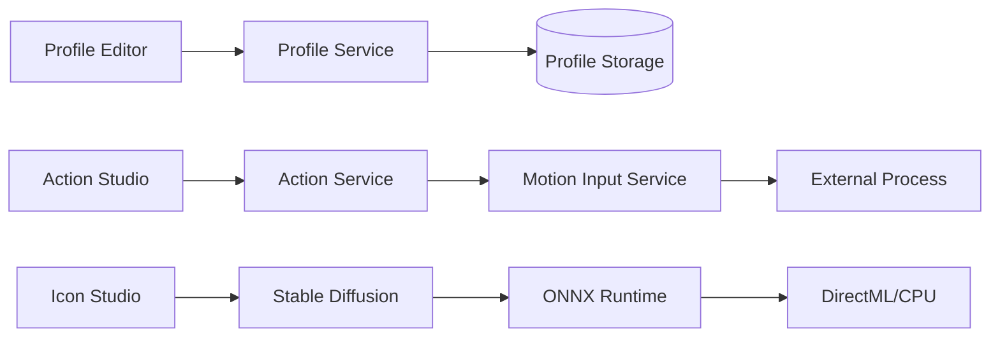
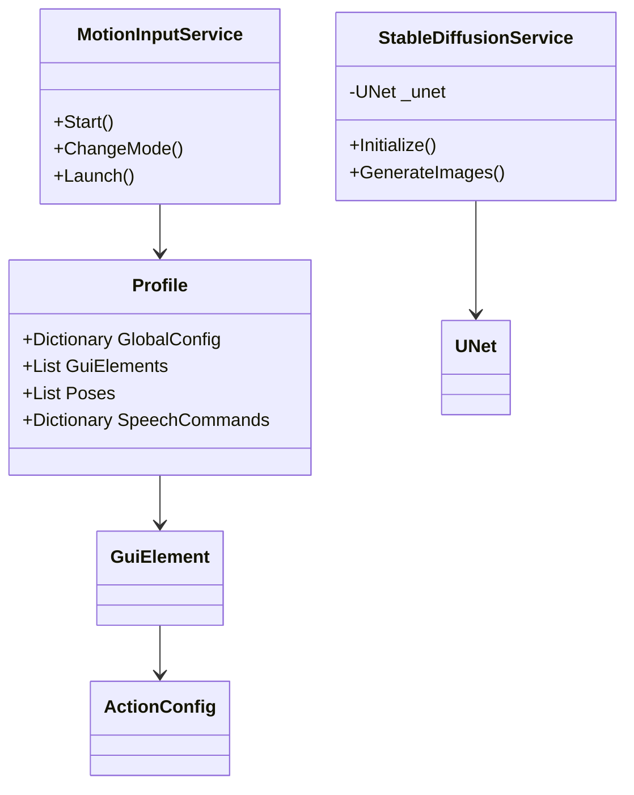
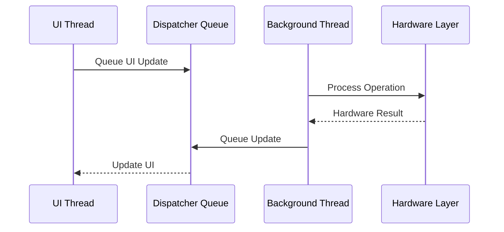
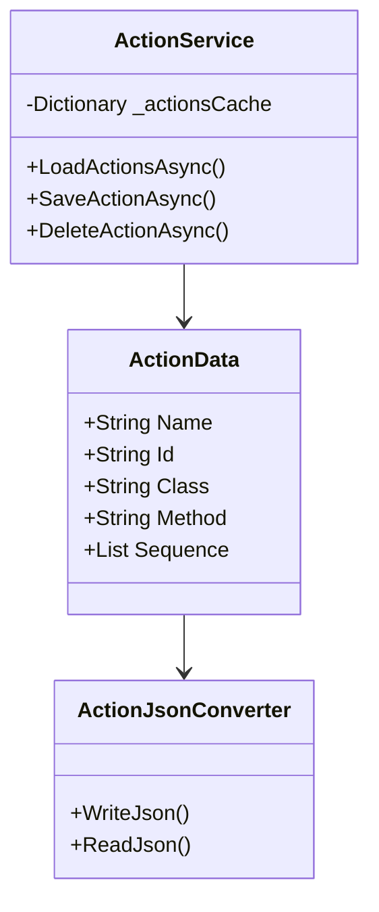
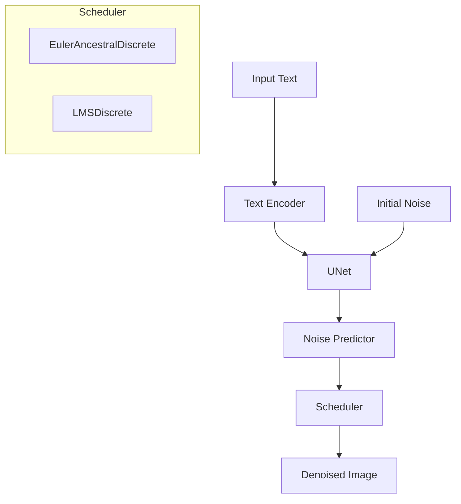
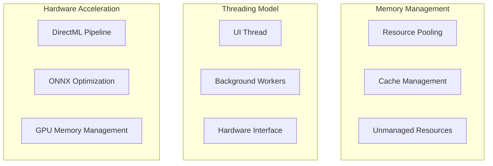
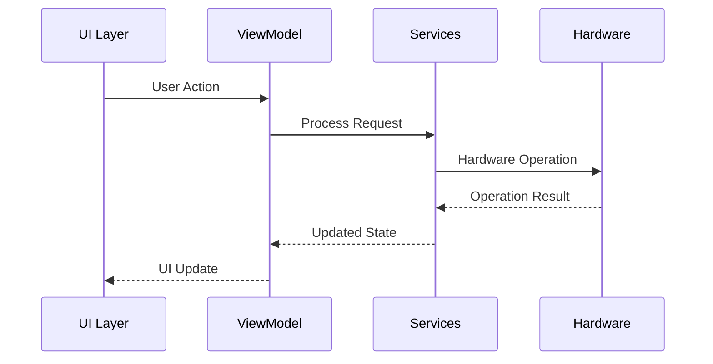
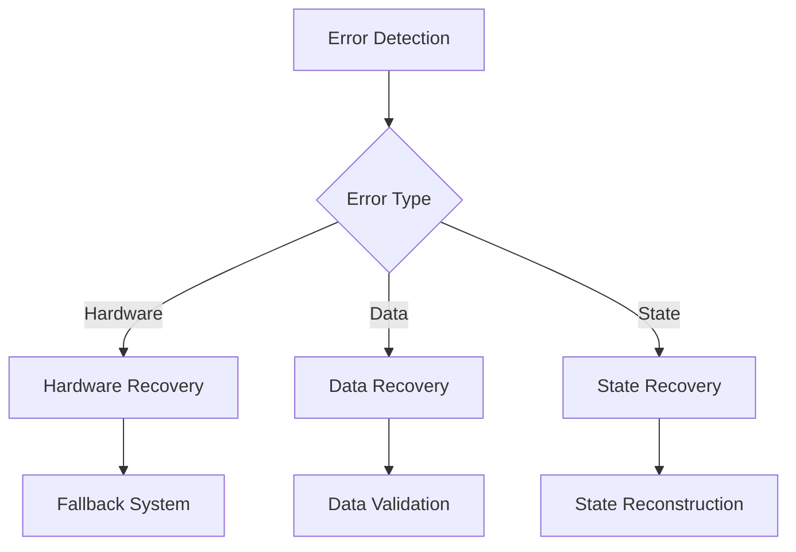

# MI_GUI_WinUI - Motion Input GUI Application

## System Architecture Overview

The MI_GUI_WinUI solution is a comprehensive Windows desktop application built with WinUI 3, providing a modern interface for motion input configuration and management. The application leverages advanced technologies including DirectX for hardware acceleration, ONNX Runtime for machine learning capabilities, and a modular MVVM architecture for maintainable and testable code.

The solution consists of four main projects:
1. **MI_GUI_WinUI** - The main WinUI 3 application providing the user interface and core functionality
2. **StableDiffusion.ML.OnnxRuntime** - ML component for text-to-image generation
3. **DirectXAdapterSelector** - Native C++ component for GPU device selection and DirectX integration
4. **MI_GUI_WinUI.Tests** - Test project for automated testing and quality assurance

## Design Patterns and Software Development Principles

The application implements several architectural and design patterns to ensure maintainability, testability, and scalability:

### Architectural Patterns

#### 1. Model-View-ViewModel (MVVM)
The core architectural pattern used throughout the application, providing clear separation of concerns:
- **Models**: Data structures and business logic (Profile, GuiElement, ActionConfig)
- **Views**: XAML-based UI components with minimal code-behind
- **ViewModels**: Intermediate layer handling UI state and business logic

Implementation examples:
```csharp
// ViewModel with observable properties and commands
public partial class ActionStudioViewModel : ViewModelBase
{
    [ObservableProperty]
    private ObservableCollection<ActionData> _actions = new();

    [ObservableProperty]
    private ActionData? _selectedAction;

    [RelayCommand]
    private async Task SaveAction() { /* implementation */ }
}
```

#### 2. Dependency Injection (DI)
Services are registered and resolved through Microsoft's dependency injection container:
- Constructor injection for all dependencies
- Clear lifetime management (Singleton vs Transient)
- Interface-based design for testability

```csharp
// Registration in App.xaml.cs
services.AddSingleton<INavigationService, NavigationService>();
services.AddTransient<IStableDiffusionService, StableDiffusionService>();

// Constructor injection
public class ProfileEditorViewModel : ViewModelBase
{
    private readonly IProfileService _profileService;
    private readonly IDialogService _dialogService;

    public ProfileEditorViewModel(
        IProfileService profileService,
        IDialogService dialogService,
        ILogger<ProfileEditorViewModel> logger,
        INavigationService navigationService)
        : base(logger, navigationService)
    {
        _profileService = profileService;
        _dialogService = dialogService;
    }
}
```

#### 3. Service-Oriented Architecture
Application functionality is organized into cohesive services with clear responsibilities:
- Each service focuses on a specific domain (profiles, actions, navigation)
- Services communicate through well-defined interfaces
- Asynchronous patterns for non-blocking operations

### Design Patterns

#### 1. Factory Pattern
Used for creating complex objects, particularly in UI components and test infrastructure:
- NavigationService creates ViewModels and Pages
- TestDataGenerators create test fixtures

```csharp
// Factory pattern in NavigationService
public bool Navigate<TPage, TViewModel>(Window window, object? parameter = null)
    where TPage : Page
    where TViewModel : ViewModelBase
{
    var viewModel = _serviceProvider.GetRequiredService<TViewModel>();
    var page = _serviceProvider.GetRequiredService<TPage>();
    // Configure and return
}
```

#### 2. Observer Pattern
Implemented through ObservableObject base class and INotifyPropertyChanged:
- ViewModels notify Views of property changes
- Collections use ObservableCollection for dynamic UI updates
- Event-based communication for cross-component notifications

```csharp
// Observer pattern with ObservableObject
[ObservableProperty]
private string _title;

// Event-based observers
public event EventHandler<NavigationEventArgs> NavigationCompleted;
```

#### 3. Command Pattern
Implemented via RelayCommand from CommunityToolkit.Mvvm:
- Encapsulates UI actions as objects
- Simplifies binding between UI controls and ViewModel logic
- Supports command enabling/disabling based on conditions

```csharp
// Command pattern implementation
[RelayCommand(CanExecute = nameof(CanSaveProfile))]
private async Task SaveProfile()
{
    // Implementation
}

private bool CanSaveProfile() => !string.IsNullOrEmpty(ProfileName);
```

#### 4. Strategy Pattern
Used for algorithm selection and configuration:
- Scheduler implementations in Stable Diffusion
- Adapters for different hardware configurations
- Fallback strategies for hardware compatibility

```csharp
// Strategy pattern for schedulers
public interface IScheduler
{
    float[] GetTimesteps();
    float[] GetPreviousBetas();
}

public class EulerDiscreteScheduler : IScheduler { /* implementation */ }
public class DPMSolverMultistepScheduler : IScheduler { /* implementation */ }
```

#### 5. Decorator Pattern
Applied to enhance service functionality without modifying core implementations:
- Logging decorators for service calls
- Caching decorators for performance optimization
- Error handling wrappers

```csharp
// Decorator pattern example
public class CachingProfileService : IProfileService
{
    private readonly IProfileService _innerService;
    private readonly Dictionary<string, Profile> _cache = new();

    public CachingProfileService(IProfileService innerService)
    {
        _innerService = innerService;
    }

    public async Task<Profile> GetProfileAsync(string id)
    {
        if (_cache.TryGetValue(id, out var profile))
            return profile;
            
        var result = await _innerService.GetProfileAsync(id);
        _cache[id] = result;
        return result;
    }
}
```

#### 6. Repository Pattern
Used for data access abstraction:
- ProfileService provides CRUD operations for profiles
- ActionService manages action definitions
- File-based persistence with abstracted storage

```csharp
// Repository pattern in ProfileService
public interface IProfileService
{
    Task<List<Profile>> GetAllProfilesAsync();
    Task<Profile> GetProfileByIdAsync(string id);
    Task SaveProfileAsync(Profile profile);
    Task DeleteProfileAsync(string id);
}
```

#### 7. Proxy Pattern
Implemented for resource-intensive operations:
- StableDiffusionService proxies ML model operations
- DirectXAdapterSelector proxies hardware interactions
- Lazy initialization for expensive resources

### SOLID Principles

#### 1. Single Responsibility Principle (SRP)
Each class has a single purpose and reason to change:
- WindowManager only handles window lifecycle
- NavigationService only manages navigation
- ViewModels focus on specific features

#### 2. Open/Closed Principle (OCP)
Code is open for extension but closed for modification:
- Interface-based design enables new implementations
- Base classes provide extension points
- Inheritance hierarchy for specialized behavior

#### 3. Liskov Substitution Principle (LSP)
Derived classes can substitute their base classes:
- ViewModelBase provides common behavior
- Service implementations are interchangeable
- Test mocks can replace real implementations

#### 4. Interface Segregation Principle (ISP)
Clients depend only on interfaces they use:
- Small, focused interfaces (INavigationService, IProfileService)
- No monolithic service interfaces
- Specialized interfaces for specific functionality

#### 5. Dependency Inversion Principle (DIP)
High-level modules depend on abstractions:
- All dependencies injected through constructors
- Concrete implementations resolved at runtime
- Test mocks can be injected for testing

### Other Software Principles

#### 1. Asynchronous Programming
Modern async/await patterns used throughout:
- Non-blocking UI during long operations
- Proper cancellation support
- Progress reporting for long-running tasks

```csharp
// Async pattern with cancellation and progress
public async Task<byte[]> GenerateImageAsync(
    string prompt,
    CancellationToken cancellationToken = default,
    IProgress<GenerationProgress>? progress = null)
{
    // Implementation with progress reporting
}
```

#### 2. Resource Management
Proper resource cleanup and disposal:
- IDisposable implementation for resource-intensive components
- Using statements for deterministic disposal
- Weak references to prevent memory leaks

```csharp
// Resource management with IDisposable
public class StableDiffusionService : IStableDiffusionService, IDisposable
{
    private bool _disposed = false;
    
    protected virtual void Dispose(bool disposing)
    {
        if (!_disposed)
        {
            if (disposing)
            {
                _pipeline?.Dispose();
                _pipeline = null;
            }
            _disposed = true;
        }
    }

    public void Dispose()
    {
        Dispose(true);
        GC.SuppressFinalize(this);
    }
}
```

#### 3. Defensive Programming
Robust error handling and validation:
- Input validation at service boundaries
- Exception handling with meaningful messages
- Fallback mechanisms for failure scenarios

```csharp
// Defensive programming example
public async Task<Profile> GetProfileByIdAsync(string id)
{
    if (string.IsNullOrEmpty(id))
        throw new ArgumentException("Profile ID cannot be null or empty", nameof(id));
        
    try
    {
        // Implementation
    }
    catch (FileNotFoundException)
    {
        _logger.LogWarning("Profile {Id} not found", id);
        throw new ProfileNotFoundException(id);
    }
    catch (Exception ex)
    {
        _logger.LogError(ex, "Error retrieving profile {Id}", id);
        throw new ProfileServiceException($"Failed to retrieve profile {id}", ex);
    }
}
```

#### 4. Clean Code Principles
Readable, maintainable code:
- Meaningful variable and method names
- Small, focused methods with single responsibility
- Comprehensive documentation
- Consistent formatting and style

#### 5. Test-Driven Development (TDD)
Comprehensive testing strategy:
- Unit tests for isolated components
- Integration tests for cross-component validation
- Performance tests for critical operations
- Mock-based testing for external dependencies

### Technology Stack

- **Framework**: WinUI 3 (.NET 8.0)
- **Architecture**: MVVM (Model-View-ViewModel)
- **Hardware Acceleration**: DirectX via DirectML
- **Machine Learning**: ONNX Runtime
- **Dependency Injection**: Microsoft.Extensions.DependencyInjection
- **Logging**: Microsoft.Extensions.Logging
- **JSON Processing**: Newtonsoft.Json
- **Image Processing**: SixLabors.ImageSharp
- **Testing**: MSTest with Moq for mocking
- **Build/CI**: GitHub Actions workflow

## Projects in Detail

### 1. MI_GUI_WinUI (Main Application)

The core WinUI 3 application implementing the user interface and primary business logic.

#### Key Responsibilities:
- Provide modern, responsive user interface
- Manage user interaction and navigation
- Coordinate between different services
- Handle state management and persistence
- Provide configuration interface for Motion Input

#### Key Components:
- **App.xaml.cs**: Application entry point and dependency injection configuration
- **MainWindow.xaml.cs**: Main application window with navigation frame
- **Pages/**: UI implementation using XAML and code-behind
- **ViewModels/**: Business logic and UI state management
- **Services/**: Core service implementations
- **Models/**: Data models and business objects
- **Converters/**: Value converters for XAML bindings
- **Controls/**: Reusable UI components

### 2. StableDiffusion.ML.OnnxRuntime

Machine learning component implementing Stable Diffusion for text-to-image generation using ONNX Runtime.

#### Key Responsibilities:
- Load and manage ONNX models
- Execute the Stable Diffusion pipeline
- Provide hardware acceleration through DirectML
- Manage GPU resources and memory
- Handle model inference and image generation

#### Key Components:
- **Pipeline**: Stable Diffusion execution pipeline
- **Scheduler**: Noise scheduling implementations (Euler, DDIM, etc.)
- **UNet**: Neural network model for diffusion
- **TextEncoder**: CLIP text encoder for prompts
- **VAEDecoder**: Variational autoencoder for final image generation
- **Utilities**: Memory management and optimization tools

### 3. DirectXAdapterSelector

Native C++ component providing DirectX integration and GPU device selection.

#### Key Responsibilities:
- Enumerate available GPU devices
- Select optimal DirectX adapter
- Provide hardware information to managed code
- Enable DirectX acceleration for ONNX Runtime
- Handle fallback paths when hardware acceleration isn't available

#### Key Components:
- **DirectXAdapterSelector.cpp/.h**: Native implementation
- **COM Interop**: Managed/unmanaged boundary
- **Device Enumeration**: Graphics adapter detection
- **DirectX Integration**: DirectML provider configuration

### 4. MI_GUI_WinUI.Tests

Comprehensive test suite for automated testing and quality assurance.

#### Key Responsibilities:
- Validate core functionality
- Ensure regression protection
- Test ViewModels and Services
- Provide benchmarks and performance tests
- Validate integration between components

#### Key Components:
- **Infrastructure/**: Test base classes and utilities
- **Services/**: Tests for service implementations
- **ViewModels/**: Tests for ViewModel implementations
- **Performance/**: Performance and benchmark tests
- **TestUtils/**: Testing utilities and helpers
- **TestData/**: Test fixtures and sample data

## Core Architecture

### Main Application Flow

```mermaid
graph TD
    A[Main Application] --> B[Window Manager]
    A --> C[Navigation Service]
    
    subgraph Services Layer
        D[Motion Input Service]
        E[Action Service]
        F[Stable Diffusion Service]
        G[Logging Service]
    end
    
    subgraph UI Layer
        H[Profile Editor]
        I[Action Studio]
        J[Icon Studio]
        K[Select Profiles]
    end

    B --> UI Layer
    C --> UI Layer
    UI Layer --> Services Layer
```

### Data Flow Architecture



### Core Component Architecture



## Service Layer Implementation

### 1. Core Services

#### 1.1 WindowManager
- Manages application windows and their lifecycle
- Handles window creation, state management, and disposal
- Centralizes window-related operations
- Tracks window state and positioning
- Supports multiple window management
- Implements weak references to prevent memory leaks

Implementation details:
```csharp
public class WindowManager : IWindowManager
{
    private readonly Dictionary<Guid, Window> _windows;
    private readonly ILogger<WindowManager> _logger;
    private Window? _mainWindow;

    // Window management methods
    public void SaveWindowState(Window window)
    public void RestoreWindowState(Window window)
    public Window? GetWindowById(Guid id)
    public void RegisterWindow(Window window, Guid id)
    public void SetMainWindow(Window window)
}
```

#### 1.2 NavigationService
- Implements navigation between different pages
- Manages navigation history and state
- Supports page parameter passing
- Handles ViewModel initialization and cleanup
- Provides type-safe navigation methods
- Supports back navigation and navigation stack management

Implementation details:
```csharp
public class NavigationService : INavigationService
{
    private readonly Frame _frame;
    private readonly ILogger<NavigationService> _logger;
    private readonly IServiceProvider _serviceProvider;

    // Type-safe navigation with ViewModel integration
    public bool Navigate<TPage, TViewModel>(Window window, object? parameter = null)
        where TPage : Page
        where TViewModel : ViewModelBase
    {
        try {
            var viewModel = _serviceProvider.GetRequiredService<TViewModel>();
            var page = _serviceProvider.GetRequiredService<TPage>();
            
            // Set window reference and initialize ViewModel
            viewModel.Window = window;
            _ = viewModel.InitializeAsync();
            
            page.DataContext = viewModel;
            return _frame.Navigate(typeof(TPage), parameter);
        }
        catch (Exception ex) {
            _logger.LogError(ex, "Navigation failed");
            return false;
        }
    }
}
```

#### 1.3 MotionInputService
- Manages interaction with the MotionInput process
- Handles profile configuration and mode changes
- Maintains process lifecycle and configuration state
- Manages communication with external processes
- Implements error handling and recovery strategies
- Provides status monitoring and reporting

#### 1.4 StableDiffusionService
- Provides image generation capabilities via Stable Diffusion
- Supports both DirectML (GPU) and CPU execution
- Manages ONNX model loading and execution
- Handles fallback scenarios for hardware compatibility
- Optimizes model execution and resource utilization
- Implements progress reporting and cancellation support

### 2. Data Management

#### 2.1 ProfileService
- Manages profile data persistence
- Implements caching mechanism for performance
- Handles profile CRUD operations
- Provides JSON serialization/deserialization
- Maintains profile validation and integrity checks
- Supports profile organization and categorization

Key data structures:
```csharp
public class Profile {
    public Dictionary<string, string> GlobalConfig { get; set; }
    public List<GuiElement> GuiElements { get; set; }
    public List<PoseGuiElement> Poses { get; set; }
    public Dictionary<string, SpeechCommand> SpeechCommands { get; set; }
    public string Name { get; set; }
    public string Description { get; set; }
    public bool IsEnabled { get; set; }
}

public class GuiElement {
    public string File { get; set; }
    public List<int> Position { get; set; }
    public int Radius { get; set; }
    public string Skin { get; set; }
    public string TriggeredSkin { get; set; }
    public ActionConfig Action { get; set; }
}

public class PoseGuiElement {
    public string? Landmark { get; set; }
    public List<string> Landmarks { get; set; }
    public ActionConfig Action { get; set; }
}
```

#### 2.2 ActionService
- Manages action definitions and configurations
- Handles serialization and persistence of actions
- Provides action validation and integrity checks
- Implements action execution and coordination
- Supports action categorization and filtering
- Maintains action templates and customization

### 3. UI Components

#### 3.1 Pages
- **HomePage**: Application entry point and dashboard
  - Provides overview of application functionality
  - Offers navigation to main features
  - Displays system status and notifications

- **ActionStudioPage**: Action configuration interface
  - Enables creation and editing of custom actions
  - Provides sequence building capabilities
  - Implements preview and testing features
  - Supports action import/export

- **IconStudioPage**: Icon generation and management
  - Leverages Stable Diffusion for text-to-image generation
  - Provides image editing and customization
  - Supports icon categorization and organization
  - Implements image format conversion and optimization

- **ProfileEditorPage**: Profile creation and editing
  - Provides interface for defining profile configurations
  - Supports GUI element placement and configuration
  - Enables action assignment to GUI elements
  - Implements validation and error checking

- **SelectProfilesPage**: Profile selection and management
  - Displays available profiles with preview
  - Enables profile activation and deactivation
  - Provides profile organization tools
  - Supports profile import/export

#### 3.2 Controls
- **PageHeader**: Consistent header across pages
  - Provides navigation controls and page title
  - Implements consistent styling and layout
  - Supports contextual commands and actions

- **ActionConfigurationDialog**: Action setup interface
  - Provides configuration options for actions
  - Implements validation and error reporting
  - Supports different action types and settings

- **ResizableImage**: Image control with resize capabilities
  - Provides image resizing with aspect ratio preservation
  - Implements zoom and pan functionality
  - Supports image format conversion and optimization

### 4. MVVM Implementation

#### 4.1 ViewModels
- Implement `ObservableObject` for property change notifications
- Handle UI logic and state management
- Coordinate between Views and Services
- Implement proper initialization and cleanup
- Support error handling and recovery
- Provide command implementations for UI actions

All ViewModels derive from a common base class:
```csharp
public partial class ViewModelBase : ObservableObject
{
    private readonly ILogger _logger;
    private readonly INavigationService _navigationService;
    private WeakReference<Window>? _windowReference;

    protected ViewModelBase(
        ILogger logger,
        INavigationService navigationService)
    {
        _logger = logger;
        _navigationService = navigationService;
    }

    public Window? Window {
        get => _windowReference != null && _windowReference.TryGetTarget(out var window) ? window : null;
        set {
            if (_windowReference == null) {
                _windowReference = new WeakReference<Window>(value);
            } else {
                if (value == null) {
                    _windowReference = null;
                } else {
                    _windowReference.SetTarget(value);
                }
            }
            OnWindowChanged();
        }
    }

    protected virtual void OnWindowChanged() { }

    public virtual Task InitializeAsync() => Task.CompletedTask;

    public virtual void Cleanup() {
        _windowReference = null;
    }

    protected async Task ExecuteWithErrorHandlingAsync(Func<Task> action, string actionName)
    {
        try {
            await action();
        }
        catch (Exception ex) {
            _logger.LogError(ex, "Error in {ActionName}", actionName);
            await ShowErrorAsync($"Error: {ex.Message}");
        }
    }

    protected virtual Task ShowErrorAsync(string message) => Task.CompletedTask;
}
```

Example ViewModel implementation:
```csharp
public partial class ActionStudioViewModel : ViewModelBase
{
    private readonly IActionService _actionService;
    private XamlRoot? _xamlRoot;

    [ObservableProperty]
    private ObservableCollection<ActionData> _actions = new();

    [ObservableProperty]
    private ActionData? _selectedAction;

    [ObservableProperty]
    private string? _errorMessage;

    [RelayCommand]
    private async Task SaveAction()
    {
        await ExecuteWithErrorHandlingAsync(async () => {
            if (SelectedAction == null) return;
            
            await _actionService.SaveActionAsync(SelectedAction);
            await LoadActionsAsync();
        }, "SaveAction");
    }

    public override async Task InitializeAsync()
    {
        await base.InitializeAsync();
        await LoadActionsAsync();
    }

    public override void Cleanup()
    {
        Actions.Clear();
        SelectedAction = null;
        _xamlRoot = null;
        base.Cleanup();
    }

    protected override void OnWindowChanged()
    {
        base.OnWindowChanged();
        if (Window != null) {
            _xamlRoot = Window.Content?.XamlRoot;
        } else {
            _xamlRoot = null;
        }
    }

    protected override async Task ShowErrorAsync(string message)
    {
        ErrorMessage = message;
        if (_xamlRoot != null) {
            await DialogHelper.ShowError(message, _xamlRoot);
        }
    }
}
```

### 5. Error Handling & Logging

The application implements a comprehensive error handling and logging strategy:

- Centralized logging through LoggingService
- Structured logging with different severity levels
- Exception handling at service boundaries
- Custom logger provider implementation
- Contextual error information
- User-friendly error messages
- Diagnostic information for troubleshooting
- Error recovery strategies

Example implementation:
```csharp
public class LoggingService : ILoggingService
{
    private readonly ILogger<LoggingService> _logger;

    public LoggingService(ILogger<LoggingService> logger)
    {
        _logger = logger;
    }

    public void LogInformation(string message)
    {
        _logger.LogInformation(message);
    }

    public void LogError(Exception ex, string message)
    {
        _logger.LogError(ex, message);
    }

    public void LogWarning(string message)
    {
        _logger.LogWarning(message);
    }

    public void LogDebug(string message)
    {
        _logger.LogDebug(message);
    }
}
```

### 6. Dependency Management

The application uses Microsoft's dependency injection container with the following registration pattern:

```csharp
private void ConfigureServices(IServiceCollection services)
{
    // Configuration
    var configuration = a ConfigurationBuilder()
        .SetBasePath(AppContext.BaseDirectory)
        .AddJsonFile("appsettings.json", optional: false)
        .Build();
    services.AddSingleton<IConfiguration>(configuration);

    // Core services
    services.AddSingleton<ILoggingService, LoggingService>();
    services.AddSingleton<IWindowManager, WindowManager>();
    services.AddSingleton<INavigationService, NavigationService>();
    services.AddSingleton<IActionService, ActionService>();
    services.AddSingleton<IMotionInputService, MotionInputService>();
    services.AddSingleton<IProfileService, ProfileService>();
    services.AddSingleton<IDialogService, DialogService>();

    // Transient services
    services.AddTransient<IStableDiffusionService, StableDiffusionService>();

    // ViewModels
    services.AddTransient<MainWindowViewModel>();
    services.AddTransient<SelectProfilesViewModel>();
    services.AddTransient<ActionStudioViewModel>();
    services.AddTransient<IconStudioViewModel>();
    services.AddTransient<ProfileEditorViewModel>();

    // Pages
    services.AddTransient<HomePage>();
    services.AddTransient<ActionStudioPage>();
    services.AddTransient<IconStudioPage>();
    services.AddTransient<ProfileEditorPage>();
    services.AddTransient<SelectProfilesPage>();
}
```

### 7. Hardware Integration

#### 7.1 DirectX Integration
- DirectML support for hardware acceleration
- Automatic fallback to CPU when DirectX is unavailable
- Hardware capability detection and adaptation
- Dynamic GPU device selection
- Performance monitoring and optimization

Implementation through DirectXAdapterSelector:
```cpp
// Native C++ component for DirectX integration
class DirectXAdapterSelector
{
public:
    static HRESULT EnumerateAdapters(
        _Out_ std::vector<AdapterInfo>& adapterInfoList);
    
    static HRESULT GetBestAdapter(
        _Out_ AdapterInfo& adapterInfo);
    
    static HRESULT GetAdapterById(
        _In_ UINT adapterId,
        _Out_ AdapterInfo& adapterInfo);
};
```

#### 7.2 ONNX Runtime Integration
- Model loading and execution with configurable parameters:
  - Inference steps (default: 75)
  - Guidance scale (default: 8.5)
  - DirectML/CPU execution provider selection
  - GPU device ID configuration
- Support for multiple ONNX model components:
  - Text encoder
  - UNet
  - VAE decoder
  - Safety checker
- Automatic model initialization and resource management
- Progress tracking and performance metrics
- Fallback mechanisms for hardware compatibility

#### 7.3 Stable Diffusion Pipeline
- Text-to-image generation capabilities
- Model configuration and initialization
- Performance monitoring:
  - Iterations per second tracking
  - Execution time measurement
  - Progress percentage updates
- Error handling and safety checks
- Resource cleanup and memory management

Implementation details:
```csharp
public class StableDiffusionPipeline : IDisposable
{
    private readonly UNet _unet;
    private readonly TextEncoder _textEncoder;
    private readonly VAEDecoder _vaeDecoder;
    private readonly IScheduler _scheduler;
    private readonly IRandom _random;
    private readonly ILogger<StableDiffusionPipeline> _logger;

    // Pipeline execution methods
    public async Task<byte[]> GenerateImageAsync(
        string prompt,
        string negativePrompt,
        int inferenceSteps,
        float guidanceScale,
        int seed,
        IProgress<GenerationProgress>? progress = null,
        CancellationToken cancellationToken = default)
    {
        // Implementation details
    }
}
```

## Testing Infrastructure

The MI_GUI_WinUI.Tests project provides a comprehensive testing infrastructure for ensuring code quality and reliability.

### Test Organization

```
MI_GUI_WinUI.Tests/
├── Infrastructure/    # Test framework components
├── TestUtils/        # Shared utilities
├── Services/         # Service-level tests
├── ViewModels/       # ViewModel tests
└── Performance/      # Performance tests
```

### Test Categories
- **Unit Tests**: Component isolation
- **Integration Tests**: Cross-component validation
- **Performance Tests**: Benchmarking and profiling
- **UI Tests**: User interface validation

### Base Test Classes

The testing framework is built on a hierarchy of base classes:

```csharp
public abstract class TestBase
{
    [TestInitialize]
    public virtual Task InitializeTest()
    {
        // Common test initialization
        return Task.CompletedTask;
    }

    [TestCleanup]
    public virtual Task CleanupTest()
    {
        // Common test cleanup
        return Task.CompletedTask;
    }
}

public abstract class UnitTestBase : TestBase
{
    protected Mock<IServiceProvider> MockServiceProvider;
    
    [TestInitialize]
    public override async Task InitializeTest()
    {
        await base.InitializeTest();
        MockServiceProvider = new Mock<IServiceProvider>();
        
        // Setup common mocks
    }
}

public abstract class ViewModelTestBase : UnitTestBase
{
    protected Mock<INavigationService> MockNavigation;
    protected Mock<IProfileService> MockProfileService;
    protected Mock<IActionService> MockActionService;
    protected Mock<IDialogService> MockDialogService;

    [TestInitialize]
    public override async Task InitializeTest()
    {
        await base.InitializeTest();
        
        MockNavigation = new Mock<INavigationService>();
        MockProfileService = new Mock<IProfileService>();
        MockActionService = new Mock<IActionService>();
        MockDialogService = new Mock<IDialogService>();
    }
}
```

### Service Tests

Example service test implementation:

```csharp
[TestClass]
public class ProfileServiceTests : UnitTestBase
{
    private Mock<ILogger<ProfileService>> _mockLogger;
    private Mock<IFileSystem> _mockFileSystem;
    private ProfileService _profileService;

    [TestInitialize]
    public override async Task InitializeTest()
    {
        await base.InitializeTest();
        
        _mockLogger = new Mock<ILogger<ProfileService>>();
        _mockFileSystem = new Mock<IFileSystem>();
        
        _profileService = new ProfileService(
            _mockLogger.Object,
            _mockFileSystem.Object);
    }

    [TestMethod]
    public async Task LoadProfilesAsync_ShouldReturnProfiles_WhenProfilesExist()
    {
        // Arrange
        var sampleProfiles = GetSampleProfiles();
        SetupMockFileSystem(sampleProfiles);
        
        // Act
        var result = await _profileService.LoadProfilesAsync();
        
        // Assert
        Assert.IsNotNull(result);
        Assert.AreEqual(sampleProfiles.Count, result.Count);
        // Additional assertions
    }
}
```

### ViewModel Tests

Example ViewModel test implementation:

```csharp
[TestClass]
public class ActionStudioViewModelTests : ViewModelTestBase
{
    private ActionStudioViewModel _viewModel;

    [TestInitialize]
    public override async Task InitializeTest()
    {
        await base.InitializeTest();
        
        _viewModel = new ActionStudioViewModel(
            MockActionService.Object,
            new Logger<ActionStudioViewModel>(new LoggerFactory()),
            MockNavigation.Object);
    }

    [TestMethod]
    public async Task InitializeAsync_ShouldLoadActions()
    {
        // Arrange
        var sampleActions = GetSampleActions();
        MockActionService
            .Setup(s => s.LoadActionsAsync())
            .ReturnsAsync(sampleActions);
        
        // Act
        await _viewModel.InitializeAsync();
        
        // Assert
        Assert.AreEqual(sampleActions.Count, _viewModel.Actions.Count);
        MockActionService.Verify(s => s.LoadActionsAsync(), Times.Once);
    }
}
```

### Performance Tests

Example performance test implementation:

```csharp
[TestClass]
public class StableDiffusionPerformanceTests : TestBase
{
    private StableDiffusionService _service;
    private PerformanceTracker _tracker;

    [TestInitialize]
    public override async Task InitializeTest()
    {
        await base.InitializeTest();
        
        _service = new StableDiffusionService(
            new Logger<StableDiffusionService>(new LoggerFactory()));
        _tracker = new PerformanceTracker();
    }

    [TestMethod]
    public async Task ImageGeneration_Performance()
    {
        // Arrange
        const string prompt = "a photo of a cat";
        const int iterations = 3;
        
        // Act
        _tracker.Start();
        
        for (int i = 0; i < iterations; i++)
        {
            await _service.GenerateImageAsync(prompt);
        }
        
        var metrics = _tracker.Stop();
        
        // Assert
        Assert.IsTrue(metrics.AverageExecutionTime < 10000, 
            $"Image generation took too long: {metrics.AverageExecutionTime}ms");
    }
}
```

## Performance Considerations

1. **Caching**
   - Profile data caching
   - Image caching
   - Resource pooling
   - Memory management strategies
   - Cache invalidation policies

2. **Async Operations**
   - Asynchronous file operations
   - Background processing for heavy computations
   - UI responsiveness preservation
   - Progress reporting
   - Cancellation support

3. **Resource Management**
   - Proper disposal of unmanaged resources
   - Memory optimization
   - Hardware resource coordination
   - DirectX resource management
   - ONNX session optimization

4. **UI Performance**
   - UI virtualization for large collections
   - Deferred loading strategies
   - XAML resource optimization
   - Composition thread usage
   - Animation performance optimization

## Security Considerations

1. **File Operations**
   - Secure file handling
   - Path validation and sanitization
   - Access control and permissions
   - Error handling for file operations
   - Proper cleanup of temporary files

2. **Process Management**
   - Controlled process spawning
   - Resource cleanup
   - Error containment
   - Privilege management
   - Process isolation

3. **Configuration Security**
   - Secure storage of settings
   - Encryption of sensitive data
   - Configuration validation
   - Default secure values
   - Protection against tampering

## Configuration Management

- Profile-based configuration
- Environment-specific settings
- Hardware-dependent optimizations
- Logging configuration
- Service configuration
- Application settings management
- User preference persistence

## Advanced Technical Architecture

### 1. Threading Model and Concurrency

- Dispatcher queue management for UI updates
- Background thread processing for heavy computations
- Hardware interface threading model
- Synchronization mechanisms
- Thread-safe resource access
- Cancellation support
- Progress reporting across thread boundaries

### 2. Action System Architecture


### 3. Stable Diffusion Pipeline


### 4. Type System and Value Conversion
#### Type Safety Implementation
```csharp
public class TypedConverter<T> {
    private readonly Func<object, T> _converter;
    private readonly T _defaultValue;
    // Implementation details
}
```

#### Conversion Pipelines
- Action JSON ⟶ Model Objects
- UI Values ⟶ System Types
- System Types ⟶ Hardware Instructions

### 5. Scheduler Mathematical Model
```typescript
interface SchedulerConfig {
    num_train_timesteps: 1000
    beta_start: 0.00085
    beta_end: 0.012
    beta_schedule: "scaled_linear"
    training_betas?: number[]

}

// Mathematical Models:
// 1. Linear Beta Schedule:
β_t = β_start + (β_end - β_start) * t/(T-1)

// 2. Scaled Linear Schedule:
β_t = (√β_start + t/(T-1) * (√β_end - √β_start))²

// 3. Alpha Products:
ᾱ_t = ∏(1 - β_t)

// 4. Sigma Calculation:
σ_t = √((1 - α_t)/α_t)
```

### 6. Performance Optimization System


### 7. Component Interaction Model


### 8. Error Handling and Recovery System


#### Hardware Error Recovery
- GPU initialization failures
- DirectML compatibility issues
- Memory allocation errors
- Device loss handling
- Fallback strategies and recovery

#### Data Error Recovery
- JSON parsing errors
- File system errors
- Network failures
- Cache corruption
- Data validation and repair

#### State Recovery
- View model state reconstruction
- Service state recovery
- Configuration fallbacks
- Session recovery mechanisms
- Application state persistence

## Build and Deployment

### CI/CD Pipeline

The solution uses GitHub Actions for continuous integration and deployment:

```yaml
name: CI

on:
  push:
  pull_request:
    branches: [ main, develop ]
  workflow_dispatch:

jobs:
  build-and-test:
    runs-on: windows-latest
    strategy:
      matrix:
        configuration: [Release]
        platform: [x64]
    
    steps:
    - name: Checkout
      uses: actions/checkout@v4
      
    - name: Setup .NET
      uses: actions/setup-dotnet@v4
      with:
        dotnet-version: '8.0.x'

    - name: Setup MSBuild
      uses: microsoft/setup-msbuild@v2

    - name: Install Windows App SDK
      shell: pwsh
      run: |
        nuget install Microsoft.WindowsAppSDK -Version 1.6.250205002 -OutputDirectory packages
        nuget install Microsoft.Windows.SDK.BuildTools -Version 10.0.26100.1742 -OutputDirectory packages

    # Additional steps for build, test, and deployment
```

### Build Process

The build process includes:

1. **Building DirectXAdapterSelector (C++)**
   - MSBuild for native C++ component
   - Build output caching for optimization
   - Integration with main build process

2. **Building Main Solution**
   - .NET restore for package dependencies
   - MSBuild configuration for WinUI 3 application
   - Resource compilation and inclusion

3. **Testing**
   - Unit test execution
   - Integration test execution
   - Performance test validation
   - Test result collection and reporting

4. **Packaging**
   - MSIX packaging for Windows Store deployment
   - Side-loading package generation
   - Installer creation for standalone deployment

## Maintenance and Extension

### Adding New Features

1. **Define Service Interface**
   - Create interface in Services/Interfaces folder
   - Document methods and contracts
   - Define error handling and return types

2. **Implement Service**
   - Create implementation in Services folder
   - Follow established patterns for resource management
   - Add proper logging and error handling

3. **Register in DI Container**
   - Add service registration in App.xaml.cs
   - Choose appropriate lifetime (Singleton/Transient)

4. **Create ViewModel**
   - Derive from ViewModelBase
   - Implement INotifyPropertyChanged through ObservableObject
   - Add proper initialization and cleanup

5. **Create UI**
   - Create XAML page in Pages folder
   - Set up bindings to ViewModel
   - Implement proper lifecycle handling

### Code Quality Guidelines

1. **Dependency Injection**
   - Always use constructor injection
   - Avoid service locator pattern
   - Register dependencies in DI container

2. **Error Handling**
   - Use ExecuteWithErrorHandlingAsync for user-facing operations
   - Log exceptions with appropriate context
   - Provide user-friendly error messages

3. **Resource Management**
   - Implement IDisposable where appropriate
   - Clean up resources in Cleanup method
   - Use weak references for window references

4. **Testing**
   - Write tests for new functionality
   - Follow established test patterns
   - Ensure high code coverage

5. **Documentation**
   - Document public APIs
   - Update README with new features
   - Provide usage examples

## Appendices

### A. Project Dependencies

- **Microsoft.WindowsAppSDK**: WinUI 3 framework
- **Microsoft.Extensions.DependencyInjection**: Dependency injection
- **Microsoft.Extensions.Logging**: Logging infrastructure
- **CommunityToolkit.Mvvm**: MVVM helpers and utilities
- **Newtonsoft.Json**: JSON serialization
- **Microsoft.ML.OnnxRuntime.DirectML**: ONNX Runtime with DirectML support
- **SixLabors.ImageSharp**: Image processing
- **System.Reactive**: Reactive extensions

### B. Key Code Patterns

#### 1. Observable Properties
```csharp
[ObservableProperty]
private string _title;
```

#### 2. Commands
```csharp
[RelayCommand]
private async Task Save() { /* implementation */ }
```

#### 3. Error Handling
```csharp
await ExecuteWithErrorHandlingAsync(async () => {
    // implementation
}, "OperationName");
```

#### 4. Async Initialization
```csharp
public override async Task InitializeAsync()
{
    await base.InitializeAsync();
    // custom initialization
}
```

### C. Future Development

#### 1. Planned Enhancements
- Extended GPU optimization for Stable Diffusion
- Improved action management system
- Enhanced profile organization tools
- UI accessibility improvements
- Performance optimization for low-end devices

#### 2. Research Areas
- Advanced noise scheduling algorithms
- Alternative ML models for image generation
- Improved hardware acceleration techniques
- Memory optimization strategies
- Enhanced testing methodologies
