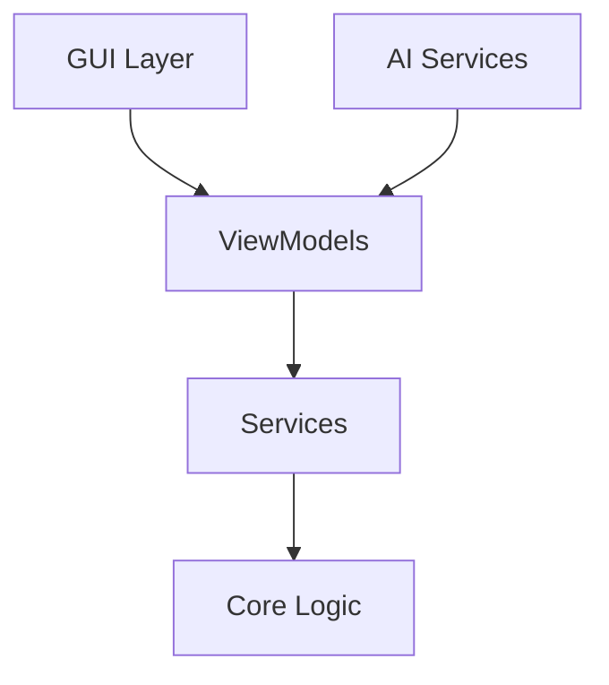

# MotionInput Configuration GUI

## Project Overview

MotionInput Configuration GUI is a comprehensive solution designed to revolutionize the way users interact with the MotionInput system, particularly focusing on gaming accessibility. This project addresses the critical challenge faced by users who previously had to manually edit complex JSON configuration files to set up their gaming profiles.

### Background and Context

MotionInput is a powerful system that enables users to control their computers through various input methods, making computing more accessible. However, the original configuration process required users to:
- Manually edit JSON configuration files
- Understand technical JSON syntax
- Remember specific key mappings
- Handle configuration validation themselves
- Create custom icons and actions through complex processes

This technical barrier significantly limited the system's accessibility, particularly for users who could benefit most from MotionInput's capabilities but lacked the technical expertise to configure it effectively.

### Solution Architecture

The Configuration GUI implements a modern, user-friendly interface built on the following architectural principles:

1. **Modern Technology Stack**:
   - WinUI 3 for a native Windows UI experience
   - MVVM architecture for clean separation of concerns
   - Service-oriented design for modularity
   - AI integration through ONNX runtime

2. **Core Services**:
   - Profile Management Service for handling configurations
   - Icon Generation Service with AI capabilities
   - Action Configuration Service for input mapping
   - Navigation Service for seamless UI flow

3. **Data Flow**:
   - Reactive UI updates using observable patterns
   - Asynchronous operations for responsive experience
   - Local storage for profile persistence
   - Real-time validation and error handling

### Implementation Details

The application is implemented with several key technical considerations:

1. **Performance Optimization**:
   - Async/await patterns for non-blocking operations
   - Efficient caching mechanisms
   - Lazy loading of resources
   - Memory management for large profiles

2. **AI Integration**:
   - Stable Diffusion model for icon generation
   - ONNX runtime optimization
   - Batch processing capabilities
   - Fallback mechanisms for reliability

3. **User Experience**:
   - Intuitive visual interfaces
   - Real-time feedback and validation
   - Progressive disclosure of advanced features
   - Comprehensive error handling

4. **Testing and Quality**:
   - Unit testing for core services
   - Integration testing for features
   - UI automation testing
   - Performance benchmarking

## Features

### Feature Overview
The application consists of four main components, each designed to address specific user needs while maintaining simplicity and efficiency:

### 1. Profile Management
Key Capabilities:
- Visual profile creation and editing interface
- Real-time configuration validation
- Profile categorization and organization
- Import/export functionality
- Preview system for configurations
- Multi-profile management

The Profile Management system revolutionizes how users interact with MotionInput configurations. Instead of manually editing complex JSON files, users can now create and modify profiles through an intuitive visual interface. The system provides real-time validation to prevent configuration errors, ensuring that all profiles are valid and functional before being saved. Users can organize their profiles into categories, making it easier to manage multiple configurations for different games or applications. The profile preview feature allows users to see their configuration changes in real-time, while the import/export functionality enables sharing profiles within the gaming community.

### 2. Icon Studio with AI Integration
Key Capabilities:
- AI-powered icon generation using Stable Diffusion
- Natural language to image conversion
- Real-time preview and adjustment
- Batch generation capabilities
- Icon organization system
- Custom icon editing tools

The Icon Studio represents a significant leap forward in customization capabilities. Powered by Stable Diffusion AI technology and optimized through ONNX runtime integration, it enables users to generate custom icons for their profiles and actions with unprecedented ease. Users can describe their desired icons in natural language, and the AI system will generate appropriate visuals. The studio includes a robust preview system that allows users to see and adjust generated icons before finalizing them. The batch generation feature streamlines the process of creating multiple icons for related actions or profiles, while the management system helps organize and categorize the generated icons effectively.

### 3. Action Studio for Gaming
Key Capabilities:
- Visual action configuration interface
- Button mapping visualization
- Input sequence creation
- Real-time action testing
- Validation system
- Custom gaming actions

Action Studio transforms the way users create and customize gaming actions. Through its visual interface, gamers can define complex input combinations and sequences without dealing with technical configurations. The studio supports basic button presses and holds, with a visual representation of button mappings that makes it intuitive to understand and modify actions. Each action can be tested and validated directly within the interface, ensuring it works as intended before being added to a profile. The studio's design focuses on making action creation accessible to users of all technical skill levels while maintaining the flexibility needed for complex gaming scenarios.

### 4. Profile Selection and Management
Key Capabilities:
- Gallery-style profile view
- Quick profile switching
- Advanced search and filtering
- Category-based organization
- Profile previews
- Drag-and-drop interface

The Profile Selection interface provides a modern, gallery-style view of all available profiles, making it easy to find and switch between different configurations. Each profile is displayed with a visual preview and key information, allowing users to quickly identify the right profile for their needs. The interface includes powerful search and filtering capabilities, enabling users to organize profiles by game, category, or custom tags. Quick switching functionality ensures minimal interruption when changing between games or applications, while the preview system lets users verify profile contents before activation.

### Key Features in Action

The integration of these four core components creates a seamless user experience for managing MotionInput configurations:

- **Streamlined Workflow**: Users can create, modify, and switch between profiles with just a few clicks, significantly reducing the time and technical knowledge required for configuration.
- **AI-Enhanced Customization**: The AI-powered icon generation system provides professional-quality visuals without requiring artistic skills from users.
- **Visual Validation**: Real-time preview and testing capabilities ensure configurations work as intended before being deployed.
- **Community Integration**: Import/export functionality encourages sharing and collaboration within the gaming community.
- **Accessibility Focus**: The intuitive interface makes advanced input configuration accessible to users of all technical skill levels.

## Technical Stack

### Frontend
- **Framework**: WinUI 3
- **Architecture**: MVVM (Model-View-ViewModel)
- **UI Components**: Custom controls and XAML templates
- **State Management**: Observable patterns and dependency injection

### AI Integration
- **Model**: Stable Diffusion
- **Runtime**: ONNX
- **Integration**: Custom service layer for AI operations
- **Optimization**: Async processing and caching

### Core Features
- Service-oriented architecture
- Dependency injection for better testability
- Async operations for responsive UI
- Comprehensive error handling
- Profile data validation
- Performance optimizations

## System Requirements

### Development Environment
- Windows 10 version 1809 or higher
- Visual Studio 2019 or higher
- .NET 6.0 or higher
- Windows App SDK

### Runtime Dependencies
- ONNX Runtime
- Windows App Runtime

## Setup Instructions

1. **Clone the Repository**
   ```bash
   git clone [repository-url]
   cd MI_GUI_WinUI
   ```

2. **Install Dependencies**
   ```bash
   dotnet restore
   ```

3. **Configure Environment**
   - Set up required environment variables
   - Configure AI model paths
   - Set up development certificates

4. **Build the Project**
   ```bash
   dotnet build
   ```

5. **Run the Application**
   ```bash
   dotnet run
   ```

## Project Structure

```
MI_GUI_WinUI/
├── App.xaml/               # Application entry point
├── Services/               # Core services
│   ├── ProfileService/     # Profile management
│   ├── IconService/       # Icon generation
│   └── ActionService/     # Action configuration
├── ViewModels/            # MVVM ViewModels
├── Pages/                 # UI Pages
├── Models/                # Business logic
├── Controls/              # Custom controls
└── Converters/           # Value converters
```

## Key Components

### Profile Management
- JSON configuration handling
- Profile validation and verification
- Profile data structures
- Storage and retrieval operations

### Icon Generation
- AI model integration
- Image processing pipeline
- Caching mechanism
- Error handling and fallbacks

### Action Configuration
- Input mapping system
- Action validation
- Testing interface
- Configuration persistence

## Architecture Overview

The application follows a service-oriented architecture with MVVM pattern:



## Development Guidelines

1. **Code Style**
   - Follow C# coding conventions
   - Use async/await patterns
   - Implement proper error handling
   - Document public APIs

2. **Testing**
   - Write unit tests for services
   - Implement integration tests
   - Include UI automation tests
   - Maintain high test coverage

3. **Performance**
   - Use async operations
   - Implement caching
   - Optimize resource usage
   - Profile critical paths

## Contributing

1. Fork the repository
2. Create a feature branch
3. Commit your changes
4. Push to the branch
5. Create a Pull Request

## License

[License details to be added]

## Acknowledgments

- MotionInput Team
- UCL Computer Science
- [Other acknowledgments]
