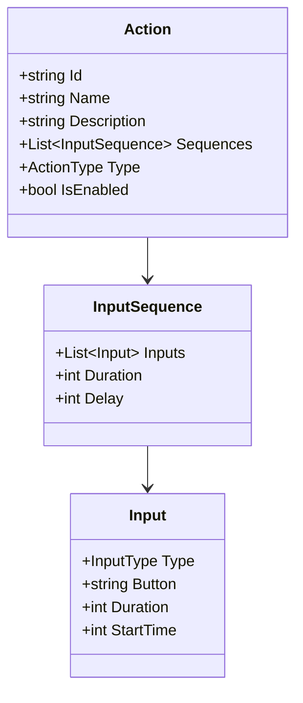
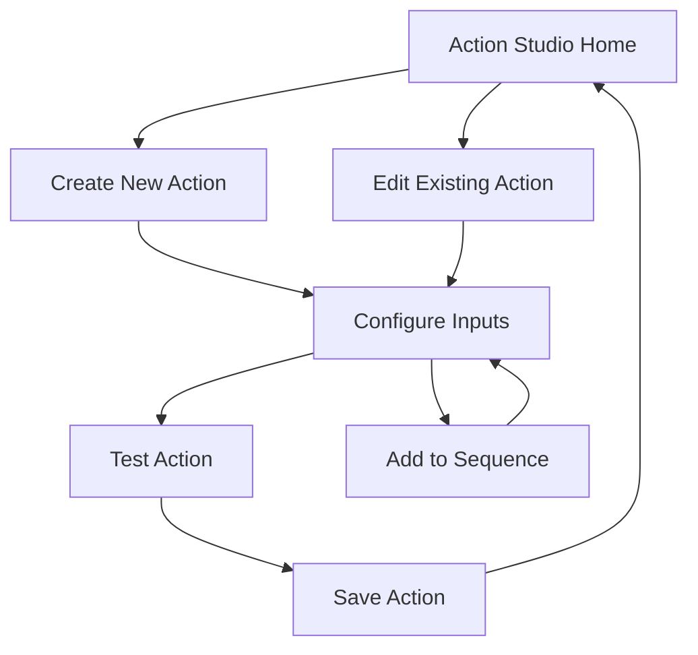

# Action Studio Implementation Plan

## 1. Core Components

### A. Visual Action Configuration Interface
1. Button Mapping Area
   - Interactive visual representation of controller/keyboard
   - Drag-and-drop functionality for mapping
   - Clear visual indicators for mapped buttons

2. Input Sequence Editor
   - Timeline-based interface for creating action sequences
   - Support for multiple input types (press, hold, release)
   - Visual timing indicators
   - Duration controls for held inputs

3. Action Preview Panel
   - Real-time visualization of configured actions
   - Animation of button sequences
   - Timing display

### B. Action Management System
1. Action Library
   - Categorized list of created actions
   - Search and filter functionality
   - Quick access to frequently used actions

2. Action Templates
   - Pre-configured common gaming actions
   - Template customization options
   - Import/export capability

## 2. Technical Implementation

### A. Data Structure

### B. Key Services
1. Action Configuration Service
   - Input validation
   - Sequence timing management
   - Action persistence

2. Input Mapping Service
   - Button mapping logic
   - Input type handling
   - Conflict detection

3. Action Testing Service
   - Real-time action simulation
   - Validation checks
   - Performance monitoring

## 3. User Interface Flow

## 4. Implementation Phases

### Phase 1: Core Infrastructure
- Basic UI layout
- Action data models
- Core services setup
- Basic input mapping

### Phase 2: Visual Editor
- Button mapping interface
- Sequence timeline
- Real-time preview
- Basic validation

### Phase 3: Advanced Features
- Template system
- Import/export functionality
- Advanced validation
- Performance optimizations

### Phase 4: Testing & Polish
- Unit tests
- Integration tests
- UI/UX improvements
- Performance tuning

## 5. Technical Considerations

### A. Performance
- Efficient action processing
- Smooth UI animations
- Optimized data structures
- Cache management

### B. Reliability
- Input validation
- Error handling
- State management
- Data persistence

### C. Extensibility
- Plugin architecture
- Custom action types
- External integrations
- API design
