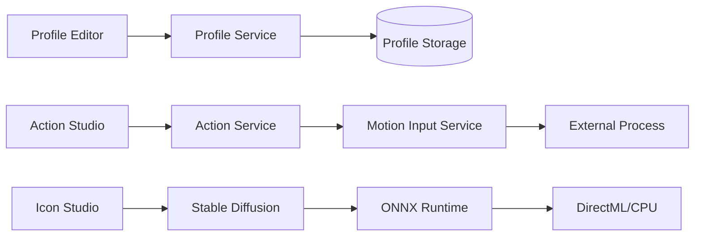
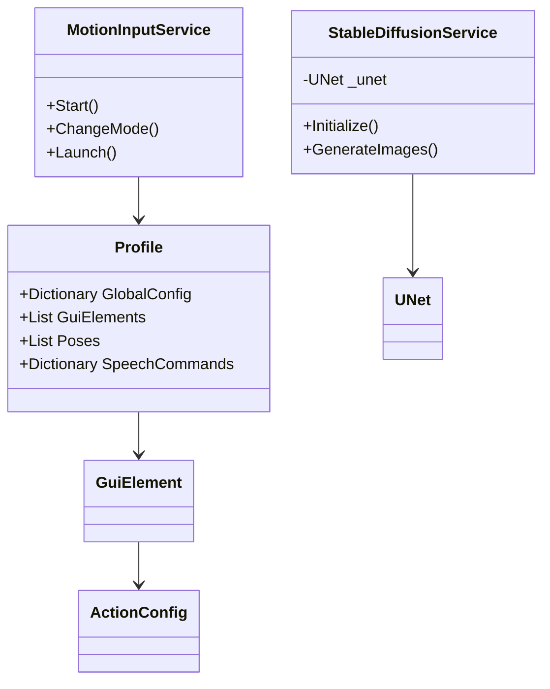
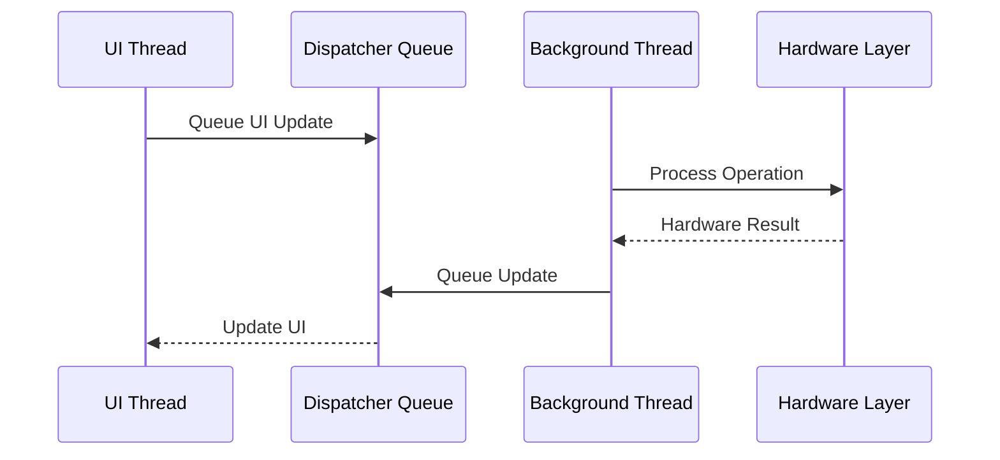
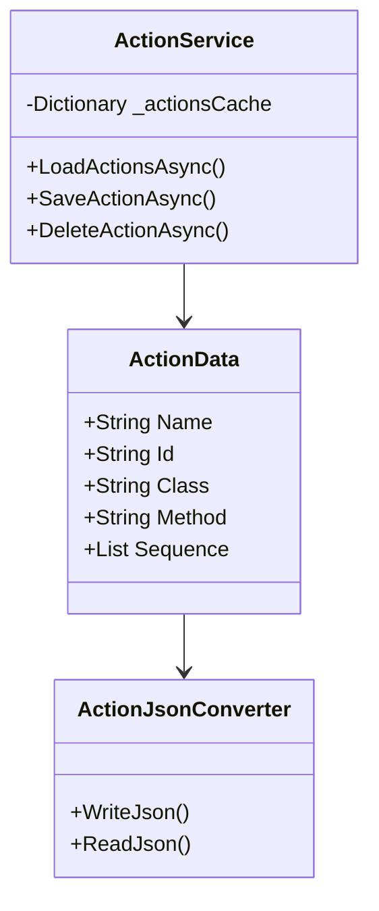
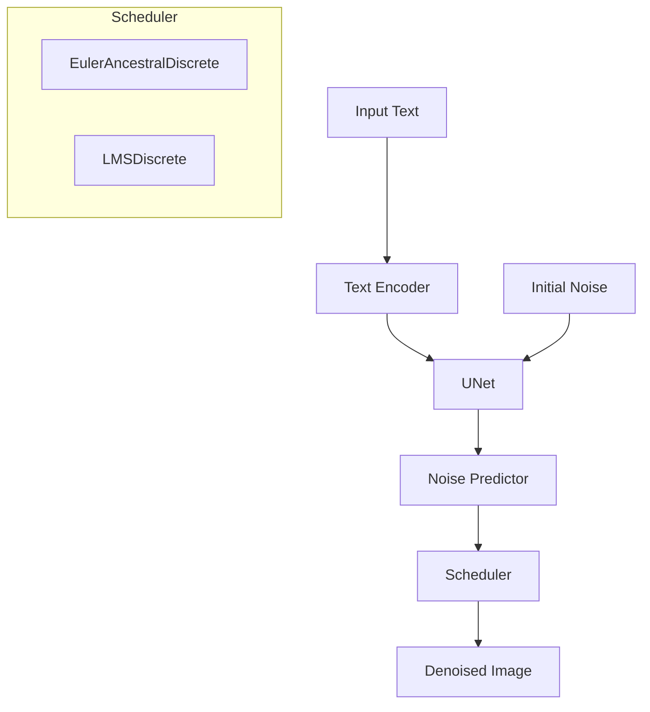
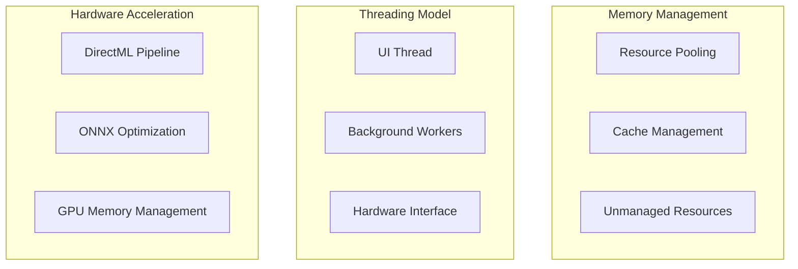
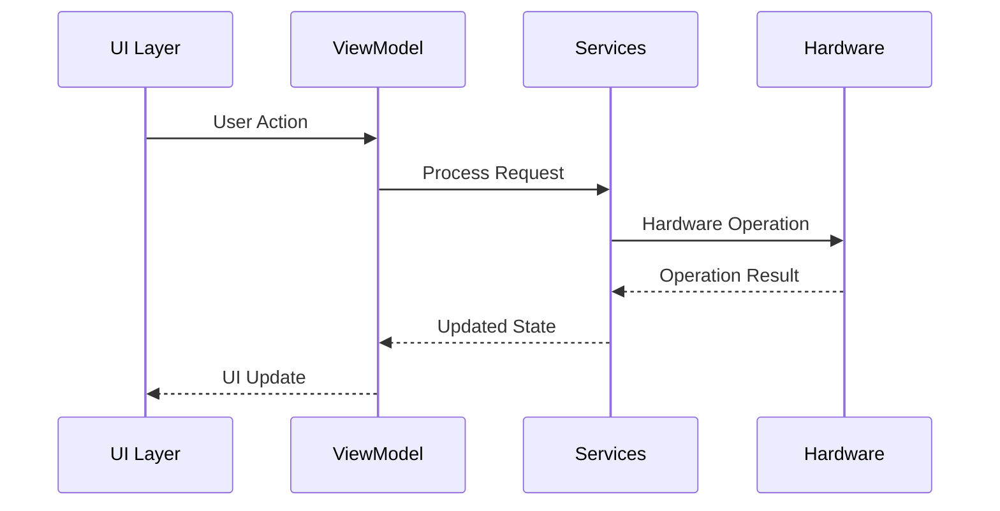
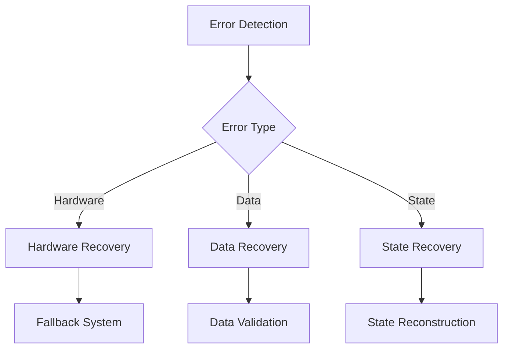

# MI_GUI_WinUI - Motion Input GUI Application

## System Architecture

A comprehensive Windows desktop application built with WinUI 3, providing a modern interface for motion input configuration and management. The application leverages advanced technologies including DirectX for hardware acceleration, ONNX Runtime for machine learning capabilities, and a modular MVVM architecture for maintainable and testable code.

### Technology Stack

- **Framework**: WinUI 3 (.NET 8.0)
- **Architecture**: MVVM (Model-View-ViewModel)
- **Hardware Acceleration**: DirectX via DirectML
- **Machine Learning**: ONNX Runtime
- **Dependency Injection**: Microsoft.Extensions.DependencyInjection
- **Logging**: Microsoft.Extensions.Logging
- **JSON Processing**: Newtonsoft.Json
- **Image Processing**: SixLabors.ImageSharp

## Core Architecture

### Main Application Flow

```mermaid
graph TD
    A[Main Application] --> B[Window Manager]
    A --> C[Navigation Service]
    
    subgraph Services Layer
        D[Motion Input Service]
        E[Action Service]
        F[Stable Diffusion Service]
        G[Logging Service]
    end
    
    subgraph UI Layer
        H[Profile Editor]
        I[Action Studio]
        J[Icon Studio]
        K[Select Profiles]
    end

    B --> UI Layer
    C --> UI Layer
    UI Layer --> Services Layer
```

### Data Flow Architecture



### Core Component Architecture



## Component Details

### 1. Core Services

#### 1.1 WindowManager
- Manages application windows and their lifecycle
- Handles window creation, state management, and disposal
- Centralizes window-related operations

#### 1.2 NavigationService
- Implements navigation between different pages
- Manages navigation history and state
- Supports page parameter passing

#### 1.3 MotionInputService
- Manages interaction with the MotionInput process
- Handles profile configuration and mode changes
- Maintains process lifecycle and configuration state

#### 1.4 StableDiffusionService
- Provides image generation capabilities via Stable Diffusion
- Supports both DirectML (GPU) and CPU execution
- Manages ONNX model loading and execution
- Handles fallback scenarios for hardware compatibility

### 2. Data Management

#### 2.1 ProfileService
- Manages profile data persistence
- Implements caching mechanism for performance
- Handles profile CRUD operations
- Provides JSON serialization/deserialization

Key data structures:
```csharp
public struct Profile {
    Dictionary<string, string> GlobalConfig
    List<GuiElement> GuiElements
    List<PoseGuiElement> Poses
    Dictionary<string, SpeechCommand> SpeechCommands
}

public struct GuiElement {
    string File
    List<int> Position
    int Radius
    string Skin
    string TriggeredSkin
    ActionConfig Action
}
```

### 3. UI Components

#### 3.1 Pages
- **HomePage**: Application entry point and dashboard
- **ActionStudioPage**: Action configuration interface
- **IconStudioPage**: Icon generation and management
- **ProfileEditorPage**: Profile creation and editing
- **SelectProfilesPage**: Profile selection and management

#### 3.2 Controls
- **PageHeader**: Consistent header across pages
- **ActionConfigurationDialog**: Action setup interface
- **ResizableImage**: Image control with resize capabilities

### 4. MVVM Implementation

#### 4.1 ViewModels
- Implement `ObservableObject` for property change notifications
- Handle UI logic and state management
- Coordinate between Views and Services

Example ViewModel structure:
```csharp
public partial class ActionStudioViewModel : ObservableObject {
    private readonly ILogger<ActionStudioViewModel> _logger;
    private readonly ActionService _actionService;
    private readonly NavigationService _navigationService;
    
    // Observable properties and commands
    // Business logic methods
}
```

### 5. Error Handling & Logging

- Centralized logging through LoggingService
- Structured logging with different severity levels
- Exception handling at service boundaries
- Custom logger provider implementation

### 6. Dependency Management

The application uses Microsoft's dependency injection container with the following registration pattern:

```csharp
services.AddSingleton<LoggingService>();
services.AddSingleton<WindowManager>();
services.AddSingleton<INavigationService, NavigationService>();
services.AddTransient<StableDiffusionService>();
// etc.
```

### 7. Hardware Integration

#### 7.1 DirectX Integration
- DirectML support for hardware acceleration
- Automatic fallback to CPU when DirectX is unavailable
- Hardware capability detection and adaptation
- Dynamic GPU device selection
- Performance monitoring and optimization

#### 7.2 ONNX Runtime Integration
- Model loading and execution with configurable parameters:
  - Inference steps (default: 75)
  - Guidance scale (default: 8.5)
  - DirectML/CPU execution provider selection
  - GPU device ID configuration
- Support for multiple ONNX model components:
  - Text encoder
  - UNet
  - VAE decoder
  - Safety checker
- Automatic model initialization and resource management
- Progress tracking and performance metrics
- Fallback mechanisms for hardware compatibility

#### 7.3 Stable Diffusion Pipeline
- Text-to-image generation capabilities
- Model configuration and initialization
- Performance monitoring:
  - Iterations per second tracking
  - Execution time measurement
  - Progress percentage updates
- Error handling and safety checks
- Resource cleanup and memory management

## Performance Considerations

1. **Caching**
   - Profile data caching
   - Image caching
   - Resource pooling

2. **Async Operations**
   - Asynchronous file operations
   - Background processing for heavy computations
   - UI responsiveness preservation

3. **Resource Management**
   - Proper disposal of unmanaged resources
   - Memory optimization
   - Hardware resource coordination

## Security Considerations

1. **File Operations**
   - Secure file handling
   - Path validation
   - Access control

2. **Process Management**
   - Controlled process spawning
   - Resource cleanup
   - Error containment

## Configuration Management

- Profile-based configuration
- Environment-specific settings
- Hardware-dependent optimizations
- Logging configuration
- Service configuration

## Advanced Technical Architecture

### 1. Threading Model and Concurrency

- Dispatcher queue management for UI updates
- Background thread processing for heavy computations
- Hardware interface threading model
- Synchronization mechanisms
- Thread-safe resource access

### 2. Action System Architecture


### 3. Stable Diffusion Pipeline


### 4. Type System and Value Conversion
#### Type Safety Implementation
```csharp
public class TypedConverter<T> {
    private readonly Func<object, T> _converter;
    private readonly T _defaultValue;
    // Implementation details
}
```

#### Conversion Pipelines
- Action JSON ⟶ Model Objects
- UI Values ⟶ System Types
- System Types ⟶ Hardware Instructions

### 5. Scheduler Mathematical Model
```typescript
interface SchedulerConfig {
    num_train_timesteps: 1000
    beta_start: 0.00085
    beta_end: 0.012
    beta_schedule: "scaled_linear"
    training_betas?: number[]
}

// Mathematical Models:
// 1. Linear Beta Schedule:
β_t = β_start + (β_end - β_start) * t/(T-1)

// 2. Scaled Linear Schedule:
β_t = (√β_start + t/(T-1) * (√β_end - √β_start))²

// 3. Alpha Products:
ᾱ_t = ∏(1 - β_t)

// 4. Sigma Calculation:
σ_t = √((1 - α_t)/α_t)
```

### 6. Performance Optimization System


### 7. Component Interaction Model


### 8. Error Handling and Recovery System


#### Hardware Error Recovery
- GPU initialization failures
- DirectML compatibility issues
- Memory allocation errors
- Device loss handling

#### Data Error Recovery
- JSON parsing errors
- File system errors
- Network failures
- Cache corruption

#### State Recovery
- View model state reconstruction
- Service state recovery
- Configuration fallbacks
- Session recovery mechanisms
