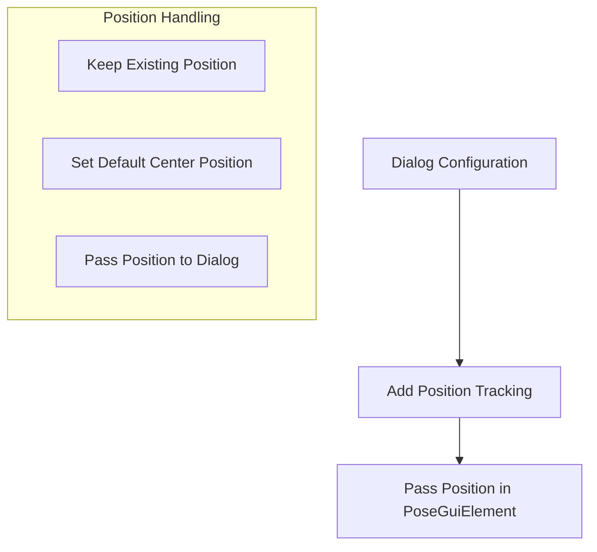

# Head Tilt Position Fix Plan

## Current Issue
The head tilt configuration is working but saving fails with a NullReferenceException because the PoseGuiElement from the dialog doesn't have position information.

## Analysis
1. In UpdateHeadTiltElement method:
```csharp
// Error occurs here when using existing element's position
var updatedInfo = existing.With(
    element: UnifiedGuiElement.FromPoseElement(headTiltElement)
        .WithPosition(
            existing.Element.Position?[0] ?? MOTION_INPUT_WIDTH / 2,  // NullReferenceException
            existing.Element.Position?[1] ?? MOTION_INPUT_HEIGHT / 2
        )
);
```

## Required Changes

1. HeadTiltConfigurationDialog:


2. Implementation Changes:
   - Add Position handling in HeadTiltConfigurationViewModel
   - Pass current position to Configure method
   - Preserve position when updating configuration

## Implementation Steps

1. Update HeadTiltConfigurationDialog.Configure method:
```csharp
public void Configure(PoseGuiElement? element, Action<PoseGuiElement> onSave)
{
    // Add position preservation
    if (element?.Position != null)
    {
        _currentPosition = element.Position;
    }
    else
    {
        _currentPosition = new List<int> { MOTION_INPUT_WIDTH / 2, MOTION_INPUT_HEIGHT / 2 };
    }
    // Rest of configure logic...
}
```

2. Update UpdateHeadTiltElement method:
```csharp
private void UpdateHeadTiltElement(PoseGuiElement headTiltElement)
{
    // If enabling head tilt, ensure position is set
    if (!string.IsNullOrEmpty(headTiltElement.File))
    {
        headTiltElement.Position = headTiltElement.Position ?? 
            new List<int> { MOTION_INPUT_WIDTH / 2, MOTION_INPUT_HEIGHT / 2 };
    }
    // Rest of update logic...
}
```

3. Modify Position Handling:
   - Add position preservation in dialog
   - Default to center position for new configurations
   - Keep existing position when updating

4. Testing Plan:
   - Test saving new head tilt configuration
   - Test updating existing configuration
   - Verify position persists across saves
   - Test loading profiles with head tilt
   - Test edge cases (disabled/enabled transitions)

## Expected Behavior
1. New head tilt configuration: placed at center of canvas
2. Updating existing configuration: maintains current position
3. Disabling head tilt: removes element completely
4. Re-enabling head tilt: restores last position if available, otherwise uses center

## Implementation Order
1. Add position handling in HeadTiltConfigurationViewModel
2. Update dialog Configure method
3. Fix UpdateHeadTiltElement position handling
4. Test all scenarios