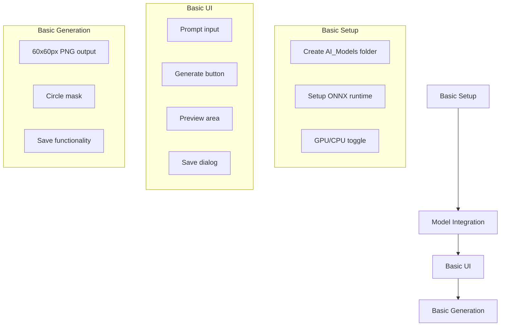
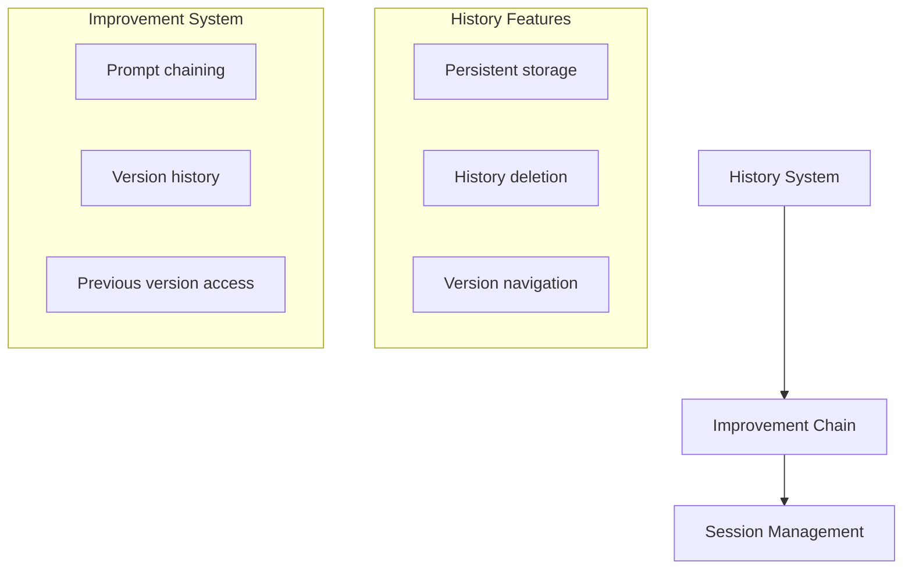

# Icon Studio Implementation Plan

## Overview
Icon Studio will be a feature allowing users to generate custom icons for MotionInput using Stable Diffusion v1.5 with ONNX runtime. The system will support text-to-image generation with additional features for customization and refinement, following the application's established MVVM architecture and dependency injection patterns.

## Feature Phases

### Core Features (Phase 1)


### Advanced Features (Phase 2)


## Architecture

### Project Structure
```
MI_GUI_WinUI/
├── AI_Models/
│   └── StableDiffusion/
│       ├── unet.onnx
│       ├── tokenizer.onnx
│       ├── text_encoder.onnx
│       └── vae.onnx
```

### Service Layer
1. **IStableDiffusionService**
   ```csharp
   public interface IStableDiffusionService
   {
       bool IsInitialized { get; }
       Task Initialize(bool useGpu);
       Task<byte[]> GenerateImage(IconGenerationSettings settings);
   }
   ```

2. **StableDiffusionService**
   ```csharp
   public class StableDiffusionService : IStableDiffusionService
   {
       private readonly ILogger _logger;
       private InferenceSession _unet;
       private InferenceSession _tokenizer;
       private InferenceSession _textEncoder;
       private InferenceSession _vae;
       private bool _useGpu;
       
       public StableDiffusionService(ILogger<StableDiffusionService> logger)
       {
           _logger = logger;
       }

       public bool IsInitialized { get; private set; }

       public async Task Initialize(bool useGpu)
       {
           try
           {
               _useGpu = useGpu;
               await LoadModel();
               IsInitialized = true;
           }
           catch (Exception ex)
           {
               _logger.LogError(ex, "Failed to initialize Stable Diffusion service");
               throw;
           }
       }

       public async Task<byte[]> GenerateImage(IconGenerationSettings settings)
       {
           ValidateSettings(settings);
           // Implementation of generation pipeline
           // Ensure 60x60px output with circular mask
       }

       private async Task LoadModel()
       {
           var modelPath = Path.Combine(AppDomain.CurrentDomain.BaseDirectory, "AI_Models", "StableDiffusion");
           var options = new SessionOptions();
           if (_useGpu)
           {
               options.AppendExecutionProvider_CUDA();
           }

           _unet = await InferenceSession.CreateAsync(Path.Combine(modelPath, "unet.onnx"), options);
           _tokenizer = await InferenceSession.CreateAsync(Path.Combine(modelPath, "tokenizer.onnx"), options);
           _textEncoder = await InferenceSession.CreateAsync(Path.Combine(modelPath, "text_encoder.onnx"), options);
           _vae = await InferenceSession.CreateAsync(Path.Combine(modelPath, "vae.onnx"), options);
       }
   }
   ```

### Data Models
1. **IconGenerationSettings**
   ```csharp
   public class IconGenerationSettings
   {
       public string Prompt { get; set; } = string.Empty;
       public Size ImageSize { get; set; } = new(60, 60); // Fixed size for initial implementation
   }
   ```

2. **GeneratedIcon**
   ```csharp
   public class GeneratedIcon
   {
       public string Id { get; set; } = Guid.NewGuid().ToString();
       public string Name { get; set; } = string.Empty;
       public string Prompt { get; set; } = string.Empty;
       public DateTime CreatedAt { get; set; } = DateTime.UtcNow;
       public byte[] ImageData { get; set; } = Array.Empty<byte>();
   }
   ```

### ViewModels

1. **IconStudioViewModel**
   ```csharp
   public partial class IconStudioViewModel : ObservableObject
   {
       private readonly ILogger _logger;
       private readonly INavigationService _navigationService;
       private readonly IStableDiffusionService _sdService;

       [ObservableProperty]
       private string _prompt = string.Empty;

       [ObservableProperty]
       private bool _useGpu = true;

       [ObservableProperty]
       private ImageSource? _previewImage;

       [ObservableProperty]
       private bool _isGenerating;

       [ObservableProperty]
       private bool _isImageGenerated;

       [ObservableProperty]
       private string _iconName = string.Empty;

       public IconStudioViewModel(
           ILogger<IconStudioViewModel> logger,
           INavigationService navigationService,
           IStableDiffusionService sdService)
       {
           _logger = logger;
           _navigationService = navigationService;
           _sdService = sdService;
       }

       [RelayCommand]
       private async Task GenerateAsync()
       {
           try
           {
               IsGenerating = true;
               var settings = new IconGenerationSettings
               {
                   Prompt = Prompt
               };

               var imageData = await _sdService.GenerateImage(settings);
               PreviewImage = await ConvertToImageSource(imageData);
               IsImageGenerated = true;
           }
           catch (Exception ex)
           {
               _logger.LogError(ex, "Error during image generation");
           }
           finally
           {
               IsGenerating = false;
           }
       }

       [RelayCommand]
       private async Task SaveAsync()
       {
           try
           {
               if (string.IsNullOrWhiteSpace(IconName))
               {
                   // Show error message
                   return;
               }

               // Save as PNG with circular mask
               // Implementation
           }
           catch (Exception ex)
           {
               _logger.LogError(ex, "Error saving icon");
           }
       }

       public override async Task InitializeAsync()
       {
           try
           {
               if (!_sdService.IsInitialized)
               {
                   await _sdService.Initialize(UseGpu);
               }
           }
           catch (Exception ex)
           {
               _logger.LogError(ex, "Failed to initialize Icon Studio");
           }
       }
   }
   ```

### UI Implementation

1. **IconStudioPage.xaml**
   ```xaml
   <Grid>
       <Grid.ColumnDefinitions>
           <ColumnDefinition Width="320"/>
           <ColumnDefinition Width="*"/>
       </Grid.ColumnDefinitions>

       <!-- Left Panel -->
       <StackPanel Grid.Column="0" Margin="16">
           <!-- GPU/CPU Selection -->
           <ToggleSwitch Header="Use GPU"
                       IsOn="{x:Bind ViewModel.UseGpu, Mode=TwoWay}"/>
           
           <!-- Prompt Input -->
           <TextBox Header="Prompt"
                    Text="{x:Bind ViewModel.Prompt, Mode=TwoWay}"
                    AcceptsReturn="True"
                    TextWrapping="Wrap"
                    Height="100"/>
           
           <!-- Generate Button -->
           <Button Content="Generate"
                   Command="{x:Bind ViewModel.GenerateCommand}"
                   HorizontalAlignment="Stretch"
                   Margin="0,16,0,0"/>
                   
           <!-- Save Section -->
           <TextBox Header="Icon Name"
                    Text="{x:Bind ViewModel.IconName, Mode=TwoWay}"
                    Visibility="{x:Bind ViewModel.IsImageGenerated, Mode=OneWay}"/>
           <Button Content="Save Icon"
                   Command="{x:Bind ViewModel.SaveCommand}"
                   Visibility="{x:Bind ViewModel.IsImageGenerated, Mode=OneWay}"/>
       </StackPanel>

       <!-- Right Panel -->
       <Grid Grid.Column="1">
           <!-- Preview with circular mask -->
           <Image Source="{x:Bind ViewModel.PreviewImage, Mode=OneWay}"
                  Width="60" Height="60"/>
           <ProgressRing IsActive="{x:Bind ViewModel.IsGenerating, Mode=OneWay}"
                        Width="40" Height="40"/>
       </Grid>
   </Grid>
   ```

## Implementation Timeline

### Phase 1: Core Features (Week 1-2)
1. **Infrastructure Setup**
   - Create AI_Models folder structure
   - Setup ONNX runtime integration
   - Implement StableDiffusionService with GPU/CPU support

2. **Basic Functionality**
   - Implement image generation (60x60px)
   - Add circular masking
   - Setup PNG export

3. **UI Implementation**
   - Build basic interface
   - Add GPU/CPU toggle
   - Implement generation and save functionality

### Phase 2: Advanced Features (Week 3-4)
1. **History System**
   - Implement chat history
   - Add version tracking
   - Setup persistent storage

2. **Improvement Chain**
   - Add improvement prompts
   - Implement version navigation
   - Add history management

## Testing Strategy
1. **Core Features**
   - Test GPU/CPU switching
   - Validate image dimensions and format
   - Test circular masking
   - Verify save functionality

2. **Advanced Features**
   - Test history persistence
   - Validate improvement chain
   - Test version navigation

## Future Enhancements
1. **History Management**
   - Persistent storage of generation history
   - History deletion functionality
   - Version navigation interface

2. **Advanced Generation**
   - Multiple generation styles
   - Size customization
   - Batch processing

Notes:
- Initial implementation focuses on 60x60px circular icons
- PNG format is required for output
- Advanced features like history and improvements will be implemented in Phase 2
- GPU/CPU selection is available from the start
