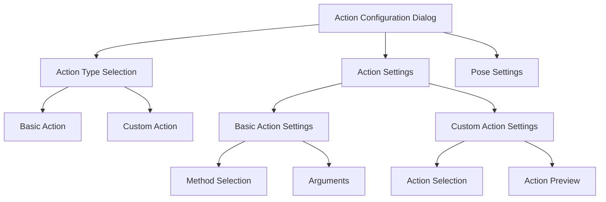

# Action Integration Plan

## Overview
This document outlines the plan for integrating Action Studio actions into the Profile Editor, allowing both custom actions and basic actions to be used with regular GUI elements and pose-triggered elements.

## UI Design

### Action Configuration Dialog Layout


### Visual Components

1. Action Type Selection
   ```
   ┌────────────────────────────────┐
   │ Select Action Type             │
   │ ┌────────────────────────────┐ │
   │ │ ○ Basic Action            ▼│ │
   │ │ ○ Custom Action           ▼│ │
   │ └────────────────────────────┘ │
   └────────────────────────────────┘
   ```

2. Basic Action Settings (when Basic Action selected)
   ```
   ┌────────────────────────────────┐
   │ Action Settings                │
   │ ┌────────────────────────────┐ │
   │ │ Method ▼                   │ │
   │ └────────────────────────────┘ │
   │ ┌────────────────────────────┐ │
   │ │ Arguments                  │ │
   │ │ [Dynamic based on method]  │ │
   │ └────────────────────────────┘ │
   └────────────────────────────────┘
   ```

3. Custom Action Settings (when Custom Action selected)
   ```
   ┌────────────────────────────────┐
   │ Select Custom Action           │
   │ ┌────────────────────────────┐ │
   │ │ Choose action... ▼         │ │
   │ └────────────────────────────┘ │
   │                                │
   │ Action Preview                 │
   │ ┌────────────────────────────┐ │
   │ │ [Sequence visualization]    │ │
   │ └────────────────────────────┘ │
   └────────────────────────────────┘
   ```

4. Pose Settings (optional section)
   ```
   ┌────────────────────────────────┐
   │ Enable Pose Detection ☐        │
   │                                │
   │ ┌────────────────────────────┐ │
   │ │ Sensitivity [0.1 - 2.0]    │ │
   │ │ Deadzone [0 - 50]          │ │
   │ │ Linear Movement ☑          │ │
   │ └────────────────────────────┘ │
   │                                │
   │ Select Landmark               │
   │ ┌────────────────────────────┐ │
   │ │ [Radio button list]        │ │
   │ └────────────────────────────┘ │
   └────────────────────────────────┘
   ```

## Implementation Plan

### 1. Model Changes

#### ActionConfigurationDialogViewModel
```csharp
public partial class ActionConfigurationDialogViewModel
{
    private readonly ActionService _actionService;
    
    [ObservableProperty]
    private bool useCustomAction;
    
    [ObservableProperty]
    private ObservableCollection<ActionData> availableActions;
    
    [ObservableProperty]
    private ActionData selectedCustomAction;
    
    // Constructor injection
    public ActionConfigurationDialogViewModel(ActionService actionService)
    {
        _actionService = actionService;
        LoadAvailableActions();
    }
}
```

#### ActionService Extensions
```csharp
public class ActionService
{
    public ActionConfig ConvertToActionConfig(ActionData action)
    {
        return new ActionConfig
        {
            ClassName = "ds4_gamepad",
            MethodName = $"chain_{action.Name}",
            Arguments = ConvertSequenceToArguments(action.Sequence)
        };
    }
}
```

### 2. Implementation Steps

1. Update ActionConfigurationDialog.xaml
   - Add radio button group for action type selection
   - Add custom action selection ComboBox
   - Add action preview section
   - Implement visibility bindings

2. Update ActionConfigurationDialogViewModel
   - Add new properties and commands
   - Implement action type switching logic
   - Add validation for custom actions
   - Update save logic

3. Extend ActionService
   - Add methods to convert between ActionData and ActionConfig
   - Add caching for loaded actions

4. Update Profile Editor
   - Ensure proper initialization of dialog
   - Handle custom action serialization

### 3. Testing Plan

1. Basic Functionality
   - Switching between basic and custom actions
   - Loading and displaying available actions
   - Saving selected actions

2. Pose Integration
   - Verify pose settings work with both action types
   - Test pose triggers with custom actions

3. Validation
   - Test input validation for both action types
   - Verify error handling and messages

4. Edge Cases
   - Empty action sequences
   - Missing custom actions
   - Invalid action configurations

## Timeline

1. Model Updates (1 day)
   - ActionConfigurationDialogViewModel modifications
   - ActionService extensions

2. UI Implementation (2 days)
   - XAML updates
   - Binding implementations
   - Visual feedback

3. Integration (1 day)
   - Connect all components
   - Error handling
   - Testing

4. Testing and Refinement (1 day)
   - Bug fixes
   - UI polish
   - Performance optimization

Total estimated time: 5 days

## Future Enhancements

1. Action Preview
   - Visual representation of sequence
   - Timeline view of button presses

2. Action Management
   - Edit custom actions from dialog
   - Quick create new actions

3. Performance Optimizations
   - Caching of custom actions
   - Lazy loading of action details
