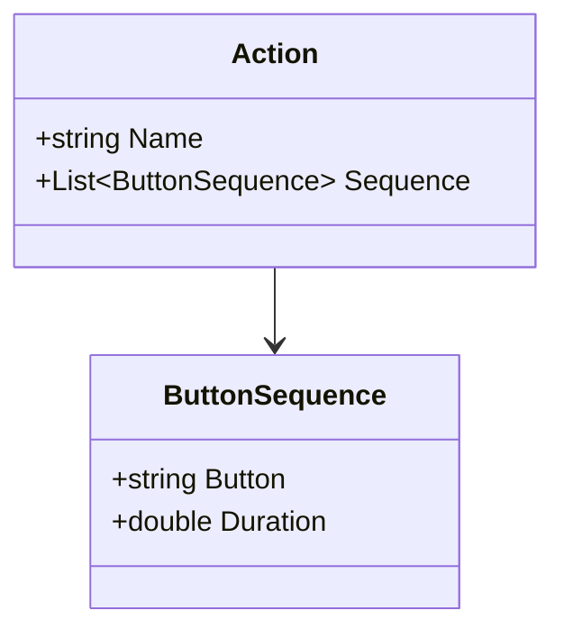
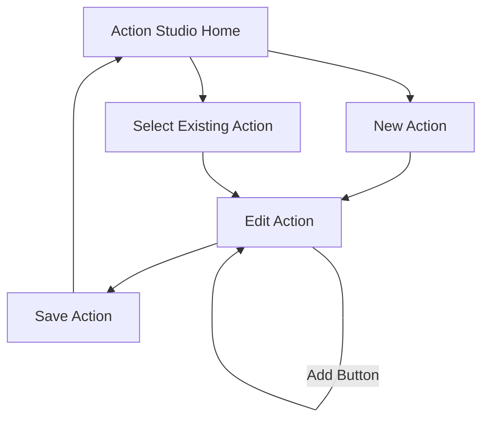

# Action Studio Implementation Plan

## 1. Core Components

### A. Two-Panel Layout
1. Saved Actions Panel (Left)
   - ListView of existing actions
   - New Action button
   - Load action functionality
   - Delete action option

2. Action Editor Panel (Right)
   - Action name input
   - Button selection dropdown
   - Add to sequence button
   - Sequence preview list
   - Save action button

## 2. Technical Implementation

### A. Data Structure

### B. Key Services
1. Action Service
   - Load/Save actions
   - Manage action sequence
   - File I/O operations

2. Validation Service
   - Action name validation
   - Sequence validation
   - Save state management

## 3. User Interface Flow

## 4. Implementation Steps

### Phase 1: Basic Structure
- Updated XAML layout
- Core view model properties
- Basic action management

### Phase 2: Sequence Building
- Button sequence logic
- Preview functionality
- Sequence manipulation

### Phase 3: File Operations
- Save/Load implementation
- Action persistence
- Error handling

## 5. Technical Considerations

### A. Performance
- Efficient action list updates
- Quick sequence manipulation
- Smooth UI interactions

### B. User Experience
- Clear feedback on actions
- Simple navigation
- Intuitive sequence building

### C. Reliability
- Proper error handling
- Data validation
- File operation safety
