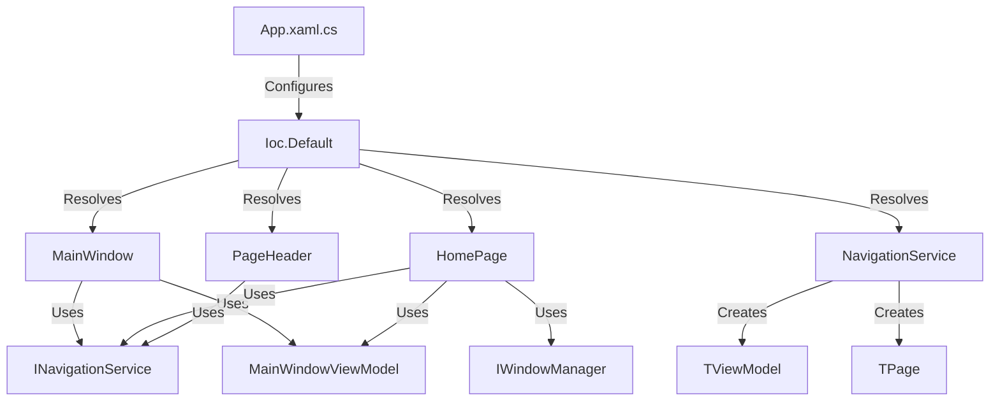

# IoC Dependency Analysis

## Current Usage Locations

### 1. MainWindow.xaml.cs
- **Dependencies Retrieved:**
  - `INavigationService`
  - `MainWindowViewModel`
  - `HomePage`
- **Context:** Constructor initialization
- **Impact:** High (Core window initialization)

### 2. HomePage.xaml.cs
- **Dependencies Retrieved:**
  - `INavigationService`
  - `IWindowManager`
  - `MainWindowViewModel`
- **Context:** Page initialization
- **Impact:** High (Main navigation page)
- **Note:** Uses GetService (nullable) instead of GetRequiredService

### 3. NavigationService.cs
- **Dependencies Retrieved:**
  - `TViewModel` (generic view models)
  - `TPage` (generic pages)
- **Context:** Navigation operations
- **Impact:** Critical (Core navigation functionality)
- **Usage Pattern:** Used in multiple methods for dynamic page/viewmodel creation

### 4. App.xaml.cs
- **Operation:** Configures IoC container
- **Context:** Application startup
- **Impact:** Critical (DI setup)
- **Note:** Central configuration point

### 5. PageHeader.xaml.cs (Control)
- **Dependencies Retrieved:**
  - `INavigationService`
- **Context:** Control initialization
- **Impact:** Medium (Reusable UI component)

## Dependency Graph

## Critical Observations

1. **Circular Dependencies Risk**
   - MainWindowViewModel is accessed from both MainWindow and HomePage
   - Could lead to initialization order issues

2. **Inconsistent Service Resolution**
   - Mix of GetService and GetRequiredService usage
   - No clear pattern for when each should be used

3. **Dynamic Resolution in Navigation**
   - NavigationService dynamically resolves both pages and viewmodels
   - Makes testing complex due to runtime type resolution

4. **UI Component Coupling**
   - PageHeader control directly depends on IoC container
   - Violates component reusability principles

## Refactoring Priorities

1. **High Priority**
   - NavigationService (critical path, multiple uses)
   - MainWindow initialization (application entry point)
   - HomePage (main navigation hub)

2. **Medium Priority**
   - PageHeader control
   - View/ViewModel resolution pattern

3. **Infrastructure**
   - IoC configuration in App.xaml.cs
   - Service resolution patterns

## Implementation Impact

1. **Breaking Changes**
   - Constructor signatures will change
   - Page activation pattern needs revision
   - Navigation system requires restructuring

2. **Required New Components**
   - IPageFactory interface and implementation
   - ViewModelLocator or similar pattern
   - Service resolution abstractions

3. **Testing Opportunities**
   - Mock page creation in navigation
   - Isolate view model initialization
   - Control UI component dependencies

## Next Steps

1. Create IPageFactory interface and implementation
2. Refactor NavigationService to use IPageFactory
3. Update MainWindow to use constructor injection
4. Create ViewModelLocator pattern
5. Update HomePage with proper dependency injection
6. Refactor PageHeader control
7. Update IoC configuration in App.xaml.cs

This analysis provides a clear picture of the current IoC usage and will guide our systematic refactoring efforts.