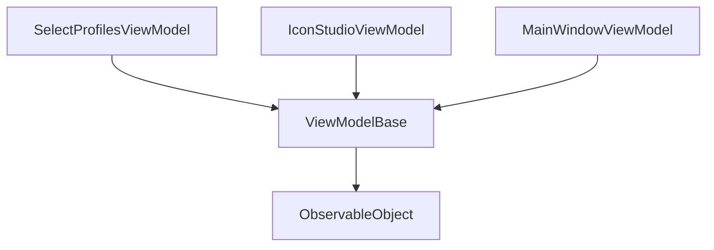

# MI GUI WinUI Implementation Plan

## Overview

This document outlines the step-by-step plan for implementing improvements to the MI GUI WinUI application, focusing on proper ViewModel lifecycle management, memory cleanup, and error handling.

## Implementation Steps

### 1. Create Base Infrastructure
- **Priority**: High
- **Files to Create/Modify**: 
  - `Services/Interfaces/INavigationService.cs`
  - `Services/Logging/LoggingConfiguration.cs`
- **Tasks**:
  - Create INavigationService interface with navigation methods
  - Setup logging infrastructure using ILogger
  - Configure dependency injection for services

### 2. Implement ViewModelBase
- **Priority**: High
- **Files to Create/Modify**:
  - `ViewModels/Base/ViewModelBase.cs`
- **Tasks**:
  - Implement Window management using WeakReference
  - Add lifecycle methods (InitializeAsync, Cleanup)
  - Add base error handling functionality
  - Implement IDisposable pattern

### 3. Update Navigation Service
- **Priority**: High
- **Files to Create/Modify**:
  - `Services/Navigation/NavigationService.cs`
- **Tasks**:
  - Implement NavigationService
  - Add ViewModel initialization logic
  - Implement error handling and logging
  - Add navigation state management

### 4. Implement Window Manager Changes
- **Priority**: High
- **Files to Create/Modify**:
  - `Services/WindowManager.cs`
- **Tasks**:
  - Add window state management
  - Implement cleanup logic for window closing
  - Add logging for window lifecycle events
  - Implement proper disposal of resources

### 5. Migrate ViewModels
- **Priority**: Medium
- **Files to Modify**:
  - `ViewModels/SelectProfilesViewModel.cs`
  - `ViewModels/IconStudioViewModel.cs`
  - Other ViewModel files
- **Tasks**:
  - Update SelectProfilesViewModel (Priority)
  - Migrate IconStudioViewModel
  - Update remaining ViewModels to inherit from ViewModelBase
  - Implement proper resource cleanup

### 6. Add Error Handling
- **Priority**: Medium
- **Files to Modify**:
  - `ViewModels/Base/ViewModelBase.cs`
  - `Services/ErrorHandling/ErrorDisplay.cs`
- **Tasks**:
  - Implement ExecuteWithErrorHandlingAsync
  - Add UI error display mechanism
  - Add error logging
  - Implement error recovery strategies

### 7. Testing & Validation
- **Priority**: High
- **Files to Create**:
  - Test files for each major component
- **Tasks**:
  - Test window lifecycle
  - Verify memory cleanup
  - Test error handling
  - Performance testing

## Success Criteria

1. No memory leaks in window management
2. Proper cleanup of resources
3. Consistent error handling across the application
4. Improved application stability
5. Better user feedback for errors

## Dependencies

- CommunityToolkit.Mvvm
- Microsoft.Extensions.Logging
- Microsoft.UI.Xaml

## Class Diagrams

## Notes

- Each step should be completed and tested before moving to the next
- Keep backward compatibility in mind during migration
- Document any breaking changes
- Update unit tests for each modified component