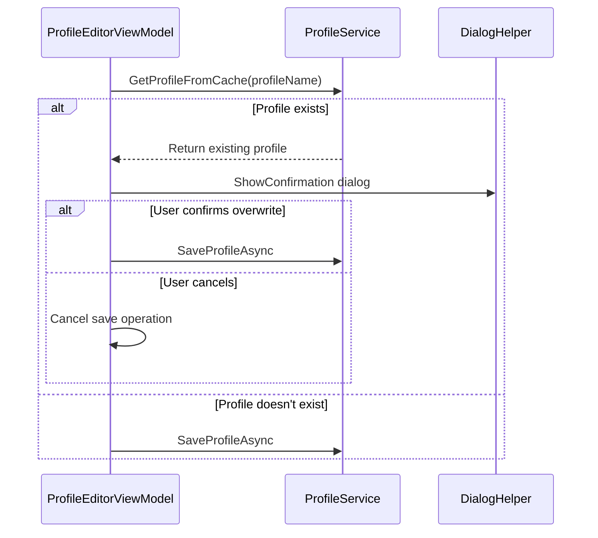

# Profile Duplicate Check Implementation Plan

## Overview
Add duplicate name check when saving profiles in Profile Editor, similar to Icon Studio's implementation.

## Current Implementation Analysis
1. Profile Editor saves profiles directly without checking for duplicates
2. Icon Studio has confirmation dialog for duplicate names using `DialogHelper.ShowConfirmation`
3. `ProfileService` maintains a cache of profiles and can check for existing profiles

## Implementation Flow


## Required Changes

### ProfileEditorViewModel
Modify the SaveProfile command to:
1. Check for existing profile using `GetProfileFromCache`
2. Show confirmation dialog if profile exists
3. Only save if confirmed or if profile is new

```csharp
[RelayCommand]
public async Task SaveProfile()
{
    // Existing validation code...
    
    var existingProfile = _profileService.GetProfileFromCache(profile.Name);
    if (existingProfile != null)
    {
        var result = await DialogHelper.ShowConfirmation(
            $"A profile named '{profile.Name}' already exists. Do you want to replace it?",
            "Replace Existing Profile?",
            XamlRoot);

        if (!result) return;
    }
    
    await _profileService.SaveProfileAsync(profile, PROFILES_DIR);
    ValidationMessage = "Profile saved successfully";
}
```

### Benefits
1. Prevents accidental profile overwrites
2. Consistent UX with Icon Studio
3. Clear user feedback
4. Uses existing service capabilities

### Testing Plan
1. Saving new profile (should save without confirmation)
2. Saving with existing name (should show confirmation)
3. Canceling confirmation (should not save)
4. Confirming overwrite (should save and update)

## Next Steps
1. Switch to Code mode to implement changes
2. Update ProfileEditorViewModel with duplicate check
3. Test all scenarios
4. Update documentation if needed