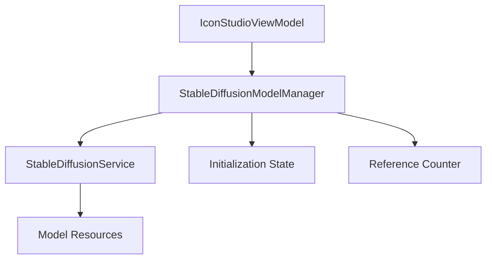

# Stable Diffusion Model Persistence Implementation Plan

## Current Issue
The Stable Diffusion models are currently being reloaded every time a user navigates to the Icon Studio page. This is inefficient because:
- Model loading is time-consuming
- Unnecessary resource usage
- Poor user experience due to wait times

## Solution Overview
Implement a singleton model manager to maintain loaded models across navigation events while properly managing system resources.

## Architecture Changes

### 1. New Component: StableDiffusionModelManager
A singleton class responsible for:
- Model lifecycle management
- Initialization state tracking
- Reference counting
- Resource management



### 2. Modified Components

#### StableDiffusionService
- Remove direct model disposal
- Integrate with ModelManager
- Track initialization state
- Handle reference management

#### IconStudioViewModel
- Use ModelManager for initialization
- Modify cleanup behavior
- Separate UI resource cleanup from model cleanup

#### IconStudioPage
- Update navigation lifecycle
- Maintain model state during navigation
- Clean only UI resources

## Implementation Steps

### 1. Create StableDiffusionModelManager
```csharp
public class StableDiffusionModelManager
{
    private static readonly Lazy<StableDiffusionModelManager> _instance;
    private bool _isInitialized;
    private bool _isInitializing;
    private int _referenceCount;
    private readonly SemaphoreSlim _initLock;

    // Methods for initialization and resource management
    public async Task EnsureInitializedAsync(bool useGpu);
    public void ReleaseReference();
}
```

### 2. Update StableDiffusionService
- Modify initialization to use ModelManager
- Update disposal pattern
- Add reference management

### 3. Update IconStudioViewModel
- Integrate ModelManager
- Separate cleanup logic:
  - UI resources (dispose)
  - Model resources (maintain)
- Update initialization flow

### 4. Cleanup Flow Changes
- Clear UI resources on navigation
- Maintain model resources
- Reference counting for potential delayed cleanup

## Testing Plan

### 1. Initialization Tests
- Verify single initialization
- Test GPU/CPU mode switching
- Check initialization state persistence

### 2. Navigation Tests
- Verify model persistence across navigation
- Test multiple navigation scenarios
- Measure initialization times

### 3. Resource Management Tests
- Monitor memory usage
- Verify proper cleanup
- Test reference counting

## Implementation Benefits
1. Improved Performance
   - Single model initialization
   - Reduced loading times
   - Better resource utilization

2. Better User Experience
   - Faster navigation
   - Maintained state
   - Reduced wait times

3. Resource Efficiency
   - Controlled model lifecycle
   - Proper memory management
   - Optimized resource usage

## Next Steps
1. Implement StableDiffusionModelManager
2. Modify StableDiffusionService
3. Update IconStudioViewModel
4. Test navigation scenarios
5. Verify resource management
6. Performance testing