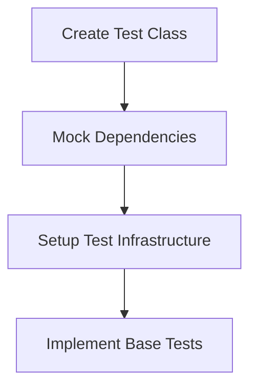

# Test Implementation Status Update

## Completed
1. ProfileService Tests
   - Basic CRUD operations
   - Cache management
   - Error handling
   - Edge cases
   - File system interactions
   - Test coverage: ~90%

## Next Service: NavigationService

According to our implementation schedule, we should now proceed with implementing tests for the NavigationService. This is a critical component as it:
1. Handles page navigation
2. Maintains navigation history
3. Manages state during navigation
4. Coordinates with PageFactory

### Implementation Steps for NavigationService Tests

1. Basic Setup (Next 2-3 hours)

2. Required Test Categories
- Basic Navigation Tests
  * Navigate to valid pages
  * Handle invalid pages
  * Test navigation history
- Parameter Handling
  * Pass and retrieve parameters
  * Parameter validation
  * State preservation
- Error Scenarios
  * Invalid page requests
  * Navigation failures
  * State corruption

3. Testing Dependencies
- Need to mock:
  * IPageFactory
  * ILogger
  * Any UI-related services

4. Test Data Requirements
- Sample pages for navigation
- Navigation parameters
- Page state information

## Recommendations

1. Switch to Code mode to:
   - Create NavigationServiceTests.cs
   - Implement basic test structure
   - Add first set of navigation tests

2. Focus Areas:
   - Page navigation flow
   - Parameter passing
   - History management
   - Error handling

3. Success Criteria:
   - All navigation paths tested
   - Parameter handling verified
   - Error scenarios covered
   - ~90% code coverage target

## Questions to Resolve

1. How to handle UI thread requirements?
2. How to test navigation events?
3. How to verify page lifecycle?

## Next Steps

1. Review NavigationService implementation
2. Create test infrastructure
3. Implement core navigation tests
4. Add parameter handling tests
5. Cover error scenarios

Would you like to proceed with NavigationService test implementation?