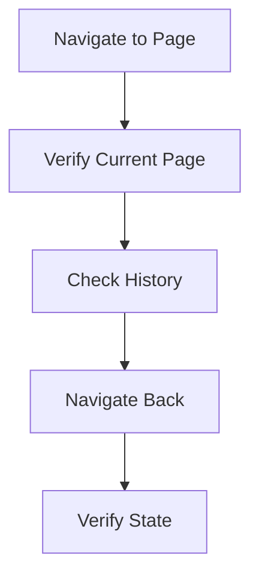
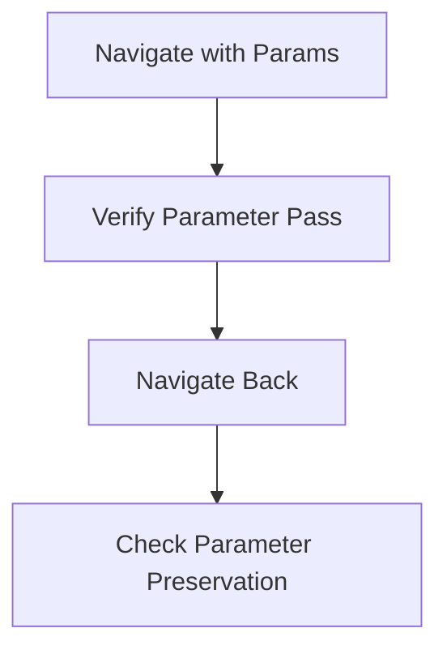
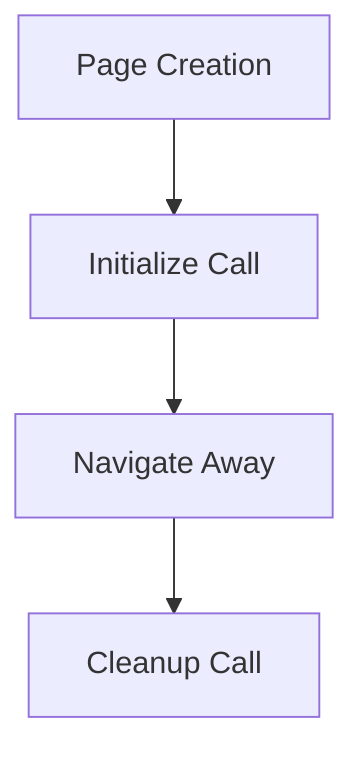
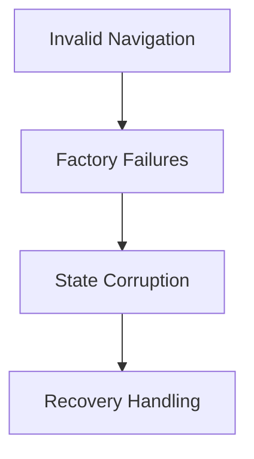

# NavigationService Test Implementation Details

## Test Infrastructure Requirements

### Required Mock Services
```csharp
private Mock<IPageFactory> _mockPageFactory;
private Mock<ILogger<NavigationService>> _mockLogger;
private NavigationService _navigationService;
```

### Mock Page Implementation
```csharp
public class MockPage 
{
    public string PageName { get; }
    public Dictionary<string, object> Parameters { get; private set; }
    
    public bool InitializeCalled { get; private set; }
    public bool CleanupCalled { get; private set; }

    public void Initialize(Dictionary<string, object> parameters)
    {
        Parameters = parameters;
        InitializeCalled = true;
    }

    public void Cleanup()
    {
        CleanupCalled = true;
    }
}
```

## Test Categories

### 1. Basic Navigation Tests



#### Test Cases
1. Navigate_ToValidPage_UpdatesCurrentPage
2. Navigate_ToInvalidPage_ThrowsException
3. NavigateBack_WithHistory_ReturnsToLastPage
4. NavigateBack_EmptyHistory_ReturnsFalse
5. CanNavigateBack_WithHistory_ReturnsTrue

### 2. Parameter Handling Tests



#### Test Cases
1. Navigate_WithParameters_PassesParametersCorrectly
2. Navigate_WithInvalidParameters_ThrowsException
3. NavigateBack_PreservesParameters
4. Navigate_NullParameters_HandledCorrectly

### 3. Page Lifecycle Tests



#### Test Cases
1. Navigate_CallsInitializeOnNewPage
2. Navigate_CallsCleanupOnOldPage
3. NavigateBack_RestoresPageState
4. Navigate_FailedInitialization_HandlesError

### 4. Error Handling Tests



#### Test Cases
1. Navigate_PageFactoryFails_ThrowsException
2. Navigate_PageInitializationFails_HandlesGracefully
3. NavigateBack_StateCorrupted_HandlesGracefully
4. Navigate_ConcurrentNavigation_HandledCorrectly

## Test Implementation Order

1. Basic Navigation
   ```csharp
   [TestMethod]
   public async Task Navigate_ToValidPage_UpdatesCurrentPage()
   {
       // Arrange
       SetupMockPage("HomePage");
       
       // Act
       await _navigationService.Navigate("HomePage");
       
       // Assert
       Assert.AreEqual("HomePage", _navigationService.CurrentPage);
   }
   ```

2. Parameter Handling
   ```csharp
   [TestMethod]
   public async Task Navigate_WithParameters_PassesParametersCorrectly()
   {
       // Arrange
       var mockPage = SetupMockPage("ParamPage");
       var parameters = new Dictionary<string, object>
       {
           { "test", "value" }
       };
       
       // Act
       await _navigationService.Navigate("ParamPage", parameters);
       
       // Assert
       Assert.AreEqual("value", mockPage.Parameters["test"]);
   }
   ```

3. Page Lifecycle
   ```csharp
   [TestMethod]
   public async Task Navigate_CallsInitializeOnNewPage()
   {
       // Arrange
       var mockPage = SetupMockPage("TestPage");
       
       // Act
       await _navigationService.Navigate("TestPage");
       
       // Assert
       Assert.IsTrue(mockPage.InitializeCalled);
   }
   ```

4. Error Handling
   ```csharp
   [TestMethod]
   public async Task Navigate_PageFactoryFails_ThrowsException()
   {
       // Arrange
       _mockPageFactory
           .Setup(f => f.CreatePage(It.IsAny<string>()))
           .Throws<InvalidOperationException>();
       
       // Act & Assert
       await Assert.ThrowsExceptionAsync<NavigationException>(
           () => _navigationService.Navigate("ErrorPage")
       );
   }
   ```

## Helper Methods

```csharp
private MockPage SetupMockPage(string pageName)
{
    var mockPage = new MockPage(pageName);
    _mockPageFactory
        .Setup(f => f.CreatePage(pageName))
        .Returns(mockPage);
    return mockPage;
}

private void SetupNavigationStack(params string[] pages)
{
    foreach (var page in pages)
    {
        _navigationService.Navigate(page).Wait();
    }
}
```

## Test Data

```csharp
public static class NavigationTestData
{
    public static Dictionary<string, object> CreateTestParameters()
    {
        return new Dictionary<string, object>
        {
            { "userId", "test-user" },
            { "viewMode", "edit" },
            { "timestamp", DateTime.Now }
        };
    }
}
```

## Success Criteria

### Coverage Goals
- Navigation Logic: 100%
- Parameter Handling: 100%
- Error Handling: 90%
- Event Handling: 85%

### Verification Points
1. Navigation State
   - Current page correct
   - History maintained
   - Parameters preserved

2. Page Lifecycle
   - Initialize called
   - Cleanup called
   - State managed

3. Error Handling
   - Exceptions thrown
   - State preserved
   - Recovery possible

## Next Steps

1. Switch to Code mode
2. Create NavigationServiceTests class
3. Implement mock page infrastructure
4. Add basic navigation tests
5. Build up complexity with parameters
6. Add error scenarios