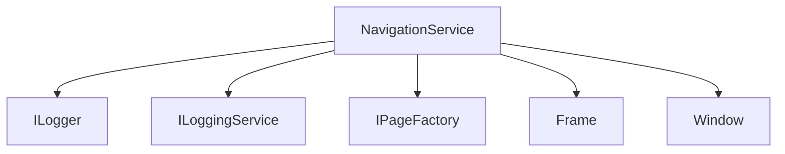

# NavigationService Test Implementation - Revised Plan

Based on actual implementation review, we need to modify our test approach to account for:
1. Window management
2. Frame initialization
3. ViewModel lifecycle
4. WinUI specific components

## Test Infrastructure Requirements

### Mock Components


### Required Mocks
```csharp
private Mock<ILogger<NavigationService>> _mockLogger;
private Mock<ILoggingService> _mockLoggingService;
private Mock<IPageFactory> _mockPageFactory;
private Mock<Frame> _mockFrame;
private Mock<Window> _mockWindow;
private NavigationService _navigationService;
```

## Test Categories

### 1. Initialization and Setup
```csharp
[TestMethod]
public void Initialize_WithValidFrame_SubscribesToEvents()
[TestMethod]
public void Initialize_WithNullFrame_ThrowsArgumentNullException()
[TestMethod]
public void RegisterWindow_NewWindow_AddsToCollection()
[TestMethod]
public void UnregisterWindow_ExistingWindow_RemovesAndCleansUp()
```

### 2. Window Management
```csharp
[TestMethod]
public void RegisterWindow_WithFrame_RegistersFrameCorrectly()
[TestMethod]
public void UnregisterWindow_WithViewModel_CleansUpViewModel()
[TestMethod]
public void FindFrameInElement_WithContentFrame_ReturnsFrame()
```

### 3. Navigation

#### Basic Navigation
```csharp
[TestMethod]
public async Task NavigateAsync_ValidPageAndViewModel_Succeeds()
[TestMethod]
public void Navigate_GenericWithParameter_PassesParameterCorrectly()
[TestMethod]
public void GoBack_WithHistory_NavigatesBack()
```

#### ViewModel Lifecycle
```csharp
[TestMethod]
public async Task NavigateAsync_InitializesViewModel()
[TestMethod]
public async Task NavigateAsync_CleansUpOldViewModel()
[TestMethod]
public async Task Navigate_DisposesOldViewModel()
```

### 4. Error Handling

#### Navigation Failures
```csharp
[TestMethod]
public async Task NavigateAsync_PageFactoryFailure_ReturnsFalse()
[TestMethod]
public async Task NavigateAsync_ViewModelInitFailure_ReturnsFalse()
[TestMethod]
public void GoBack_FailureHandled_ReturnsFalse()
```

#### State Management
```csharp
[TestMethod]
public void RegisterWindow_DuplicateRegister_HandlesGracefully()
[TestMethod]
public void UnregisterWindow_NonexistentWindow_HandlesGracefully()
```

## Mock Implementations

### 1. Mock Frame
```csharp
public class MockFrame : Frame
{
    public bool CanGoBack { get; set; }
    public object CurrentContent { get; private set; }
    public NavigationEventArgs LastNavigationEventArgs { get; private set; }

    public override bool Navigate(Type sourcePageType, object parameter)
    {
        CurrentContent = Activator.CreateInstance(sourcePageType);
        LastNavigationEventArgs = new NavigationEventArgs
        {
            SourcePageType = sourcePageType,
            Parameter = parameter
        };
        return true;
    }
}
```

### 2. Mock Window
```csharp
public class MockWindow : Window
{
    public FrameworkElement Content { get; set; }
    public string Title { get; set; }
}
```

### 3. Mock ViewModel
```csharp
public class MockViewModel : ViewModelBase
{
    public bool InitializeCalled { get; private set; }
    public bool CleanupCalled { get; private set; }
    public object InitializeParameter { get; private set; }

    public override Task InitializeAsync()
    {
        InitializeCalled = true;
        return Task.CompletedTask;
    }

    public override void Cleanup()
    {
        CleanupCalled = true;
    }
}
```

## Test Setup Pattern

```csharp
[TestClass]
public class NavigationServiceTests : UnitTestBase
{
    private NavigationService _navigationService;
    private Mock<ILogger<NavigationService>> _mockLogger;
    private Mock<ILoggingService> _mockLoggingService;
    private Mock<IPageFactory> _mockPageFactory;
    private MockFrame _mockFrame;
    private MockWindow _mockWindow;

    [TestInitialize]
    public override async Task InitializeTest()
    {
        await base.InitializeTest();

        _mockLogger = new Mock<ILogger<NavigationService>>();
        _mockLoggingService = new Mock<ILoggingService>();
        _mockPageFactory = new Mock<IPageFactory>();
        _mockFrame = new MockFrame();
        _mockWindow = new MockWindow();

        _navigationService = new NavigationService(
            _mockLogger.Object,
            _mockLoggingService.Object,
            _mockPageFactory.Object);

        _navigationService.Initialize(_mockFrame);
        _navigationService.RegisterWindow(_mockWindow);
    }
}
```

## Implementation Strategy

### Phase 1: Basic Setup (Day 1)
1. Create test infrastructure
2. Implement mock components
3. Add initialization tests
4. Test window registration

### Phase 2: Navigation Tests (Day 2)
1. Basic navigation tests
2. Parameter passing
3. Back navigation
4. Navigation events

### Phase 3: ViewModel Lifecycle (Day 3)
1. ViewModel initialization
2. Cleanup behavior
3. State preservation
4. Window association

### Phase 4: Error Handling (Day 4)
1. Navigation failures
2. Invalid states
3. Cleanup scenarios
4. Resource management

## Test Data

### Navigation Parameters
```csharp
public static class NavigationTestData
{
    public static object CreateNavigationParameters()
    {
        return new Dictionary<string, object>
        {
            { "id", Guid.NewGuid() },
            { "mode", "test" }
        };
    }
}
```

## Success Criteria

### Coverage Goals
- Navigation Logic: 95%
- Window Management: 90%
- ViewModel Lifecycle: 95%
- Error Handling: 90%

### Key Scenarios
1. Full navigation cycle
2. Window/frame management
3. ViewModel initialization
4. Error recovery
5. Resource cleanup

## Next Steps

1. Switch to Code mode
2. Create NavigationServiceTests.cs
3. Implement mock components
4. Add basic tests
5. Build up complexity