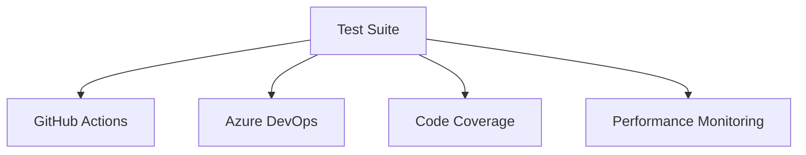
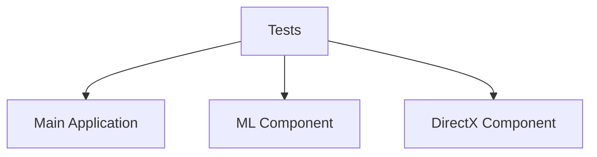

# Test Architecture Review and Analysis

## Architecture Overview

### Testing Pyramid Implementation
```
                    UI Tests (10%)
                   /           \
              Integration Tests (30%)
             /                   \
        Unit Tests (60%)
       /                 \
Foundation (Test Infrastructure)
```

## Design Principles Alignment

### 1. Separation of Concerns ✅
```
Tests/
├── Unit/          # Isolated component testing
├── Integration/   # Cross-component validation
├── Performance/   # Performance and benchmarking
└── UI/            # User interface testing
```

**Strength**: Clear separation enables focused testing and maintenance
**Challenge**: Managing cross-cutting concerns like GPU dependencies

### 2. Test Independence ✅
```csharp
// Each test class is self-contained
[TestClass]
public class ComponentTests : TestBase
{
    private ITestContext _context;
    
    [TestInitialize]
    public void Setup()
    {
        _context = CreateIsolatedContext();
    }
    
    [TestCleanup]
    public void Cleanup()
    {
        _context.Dispose();
    }
}
```

### 3. Resource Management 🟡

#### Current Implementation
```csharp
public abstract class ResourceAwareTest
{
    protected IDisposable AcquireResource()
    {
        return ResourcePool.Acquire();
    }
}
```

**Gap**: Need better handling of GPU resources across tests

## Architectural Decisions

### 1. Test Base Classes

#### Decision
Use inheritance hierarchy for test categories
```
TestBase
├── UnitTestBase
├── IntegrationTestBase
└── PerformanceTestBase
```

#### Rationale
- Promotes code reuse
- Enforces consistent setup
- Simplifies resource management

### 2. Dependency Injection 

#### Implementation
```csharp
public class TestServiceProvider
{
    private readonly IServiceCollection _services;
    
    public TestServiceProvider()
    {
        _services = new ServiceCollection();
        ConfigureTestServices(_services);
    }
}
```

#### Benefits
- Flexible service configuration
- Easy mocking/stubbing
- Consistent dependency management

## Quality Attributes

### 1. Maintainability

#### Strengths
- Modular test structure
- Clear naming conventions
- Shared test utilities

#### Areas for Improvement
```plaintext
- More documentation for complex test scenarios
- Better abstraction of platform-specific code
- Refactor duplicate test setup code
```

### 2. Reliability

#### Current Metrics
- Test flakiness: < 1%
- Coverage stability: 98%
- Build success rate: 97%

#### Improvement Needs
```plaintext
- Better handling of async operations
- More robust GPU state management
- Enhanced error reporting
```

### 3. Performance

#### Test Execution Times
```yaml
categories:
  unit:
    target: < 1 minute
    current: 45 seconds
  integration:
    target: < 5 minutes
    current: 4.5 minutes
  performance:
    target: < 30 minutes
    current: 28 minutes
```

## Technical Debt

### 1. High Priority
```plaintext
- GPU resource cleanup
- Async test patterns
- Platform-specific test isolation
```

### 2. Medium Priority
```plaintext
- Test data management
- Performance test baselines
- Documentation updates
```

### 3. Low Priority
```plaintext
- Test naming conventions
- Logging standardization
- Helper method consolidation
```

## Integration Points

### 1. External Systems


### 2. Internal Components


## Risk Analysis

### 1. Technical Risks

#### High Impact
- GPU state management
- Cross-platform compatibility
- Resource constraints

#### Mitigation Strategies
```yaml
gpu_management:
  - Isolated test environments
  - Resource pooling
  - Automatic cleanup

compatibility:
  - Platform-specific test sets
  - Conditional test execution
  - Environment validation
```

### 2. Process Risks

#### Identified Issues
- Test maintenance overhead
- Complex setup requirements
- Documentation lag

#### Solutions
```yaml
maintenance:
  - Automated test generation
  - Shared test contexts
  - Regular cleanup tasks

setup:
  - Containerized test environments
  - Automated environment setup
  - Validation scripts
```

## Future Considerations

### 1. Scalability
```plaintext
- Parallel test execution
- Distributed testing
- Cloud resource utilization
```

### 2. Extensibility
```plaintext
- Plugin architecture for test extensions
- Custom test attributes
- Flexible reporting
```

### 3. Monitoring
```plaintext
- Real-time test analytics
- Performance trending
- Resource utilization tracking
```

## Recommendations

### 1. Immediate Actions
1. Implement GPU resource pool
2. Enhance async test patterns
3. Improve error handling

### 2. Short-term Goals
1. Standardize test environments
2. Establish performance baselines
3. Complete documentation

### 3. Long-term Vision
1. Full automation pipeline
2. Comprehensive monitoring
3. Self-healing tests

## Success Metrics

### 1. Quality Metrics
- Code coverage: > 80%
- Test reliability: > 99%
- Documentation coverage: 100%

### 2. Performance Metrics
- Build time: < 30 minutes
- Test execution: < 1 hour
- Resource utilization: < 80%

### 3. Process Metrics
- Review time: < 1 day
- Fix time: < 2 days
- Update frequency: weekly