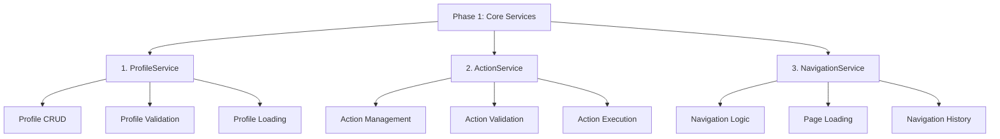
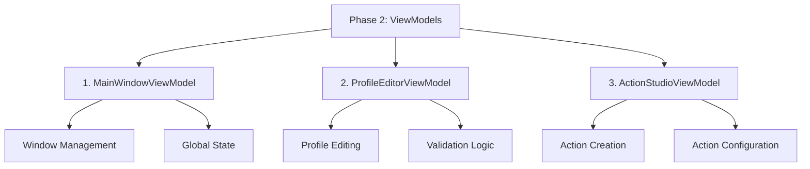
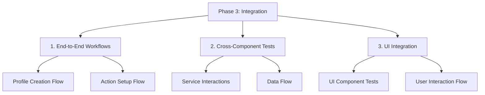

# Test Implementation Plan

## Project Structure Analysis

### Main Components to Test
1. Services:
   - ActionService
   - DialogService
   - LoggingService
   - MotionInputService
   - NavigationService
   - ProfileService
   - StableDiffusionService
   - WindowManager

2. ViewModels:
   - ActionStudioViewModel
   - IconStudioViewModel
   - ProfileEditorViewModel
   - SelectProfilesViewModel
   - HeadTiltConfigurationViewModel
   - MainWindowViewModel

## Implementation Plan

### Phase 1: Core Services Testing



#### 1. ProfileService Tests
- Profile CRUD operations
- Profile validation
- Profile loading/saving
- Error handling scenarios
- Edge cases (empty profiles, invalid data)

#### 2. ActionService Tests
- Action creation and modification
- Action validation rules
- Action execution logic
- Error handling
- Integration with MotionInput

#### 3. NavigationService Tests
- Page navigation logic
- State management
- Navigation history
- Error handling

### Phase 2: ViewModels Testing



#### 1. MainWindowViewModel Tests
- Window state management
- Global application state
- Navigation coordination
- Error handling

#### 2. ProfileEditorViewModel Tests
- Profile editing operations
- Validation logic
- UI state management
- Error handling and user feedback

#### 3. ActionStudioViewModel Tests
- Action creation workflow
- Configuration validation
- Preview functionality
- Integration with services

### Phase 3: Integration Testing



#### 1. End-to-End Workflows
- Complete profile creation flow
- Action setup and execution
- Multi-step operations

#### 2. Cross-Component Integration
- Service interactions
- Data flow between components
- State synchronization

#### 3. UI Integration Tests
- UI component interactions
- User interaction flows
- Error message display

## Implementation Guidelines

### 1. Test Structure
```csharp
[TestClass]
public class ServiceTests : UnitTestBase
{
    private IService _service;
    private Mock<IDependency> _mockDependency;

    [TestInitialize]
    public void Setup()
    {
        _mockDependency = new Mock<IDependency>();
        _service = new Service(_mockDependency.Object);
    }

    [TestMethod]
    [TestCategory("Unit")]
    public async Task Method_Scenario_ExpectedResult()
    {
        // Arrange
        // Act
        // Assert
    }
}
```

### 2. Best Practices
1. Use meaningful test names describing scenario and expected result
2. Follow AAA pattern (Arrange-Act-Assert)
3. Test both success and failure paths
4. Use appropriate test categories
5. Keep tests focused and independent
6. Use test data generators for consistent test data

### 3. Test Categories to Use
- `[UnitTest]`: Individual component tests
- `[IntegrationTest]`: Multi-component tests
- `[UITest]`: User interface tests
- `[SmokeTest]`: Critical path tests
- `[PerformanceTest]`: Performance benchmarks

## Test Data Management

### 1. Sample Data Files
- Create sample profiles in TestData/Profiles
- Create sample actions in TestData/Actions
- Create test configurations in TestData/Config

### 2. Test Utilities
- Use TestDataGenerators for consistent test data
- Use TestHelpers for common test operations
- Use SchemaValidator for data validation

## Success Criteria

1. Code Coverage Targets:
   - Services: 90%
   - ViewModels: 85%
   - Overall: 80%

2. Test Quality Metrics:
   - All critical paths covered
   - Both positive and negative scenarios tested
   - Performance benchmarks established

3. Documentation:
   - Test documentation up to date
   - Clear test naming and organization
   - Maintained test data documentation

## Implementation Schedule

### Week 1: Core Services
- ProfileService tests
- ActionService tests
- NavigationService tests

### Week 2: ViewModels
- MainWindowViewModel tests
- ProfileEditorViewModel tests
- ActionStudioViewModel tests

### Week 3: Integration
- End-to-end workflow tests
- Cross-component integration tests
- UI integration tests

### Week 4: Refinement
- Performance testing
- Coverage improvements
- Documentation updates