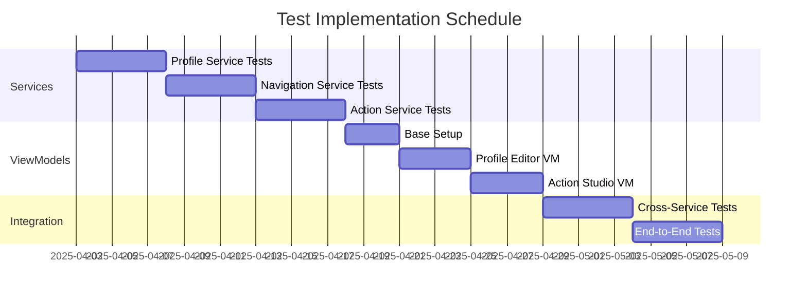
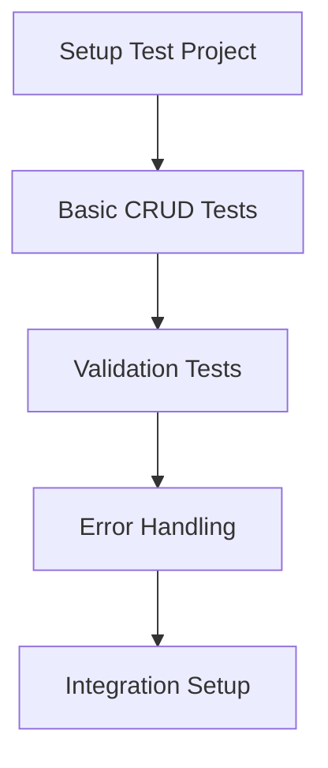
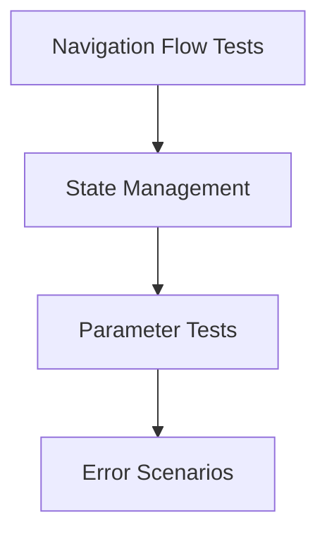
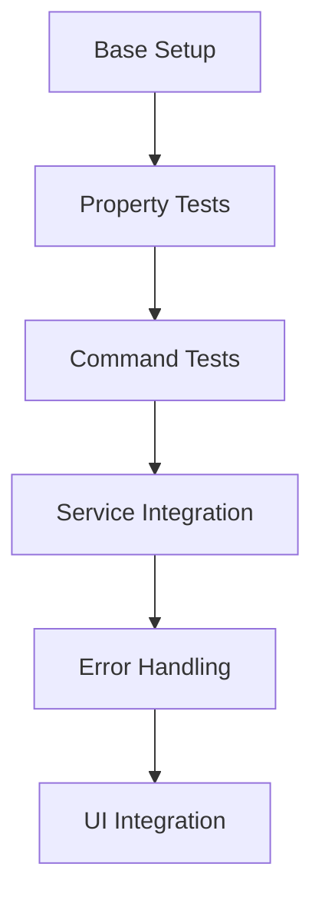
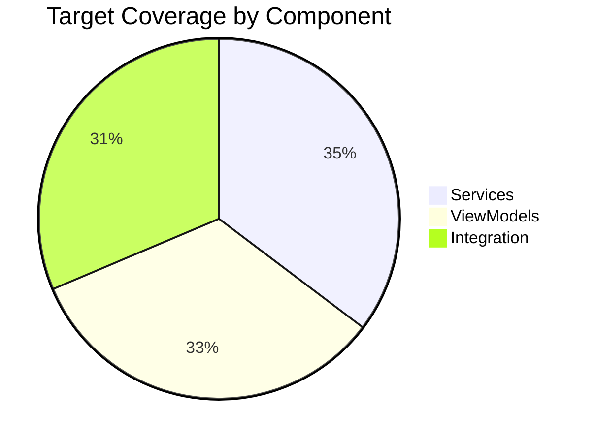

# Test Implementation Schedule

## Overview

This document outlines the schedule and priorities for implementing the test suite for MI_GUI_WinUI, building on the detailed plans for services and ViewModels.

## Week-by-Week Breakdown

### Week 1: Core Services Foundation
- **Days 1-2: Profile Service**
  - Basic CRUD operations
  - Validation logic
  - Error handling tests

- **Days 3-4: Navigation Service**
  - Navigation flow tests
  - State management
  - Parameter handling

- **Day 5: Action Service**
  - Action management tests
  - Basic validation

### Week 2: Services Completion
- **Days 1-2: Action Service (cont.)**
  - Complex action scenarios
  - Integration with MotionInput

- **Days 3-5: Support Services**
  - Dialog service tests
  - Logging service tests
  - Window management tests

### Week 3: ViewModel Foundation
- **Days 1-2: Base Infrastructure**
  - ViewModelTestBase implementation
  - Common test patterns
  - Mock setups

- **Days 3-5: Profile Editor ViewModel**
  - Property change notifications
  - Command execution
  - Validation rules

### Week 4: ViewModel Implementation
- **Days 1-3: Action Studio ViewModel**
  - Action management
  - Execution flows
  - Error handling

- **Days 4-5: Supporting ViewModels**
  - Icon Studio ViewModel
  - Select Profiles ViewModel
  - Head Tilt Configuration ViewModel

### Week 5: Integration Testing
- **Days 1-3: Cross-Service Integration**
  - Service interaction tests
  - State synchronization
  - Error propagation

- **Days 4-5: End-to-End Scenarios**
  - Complete workflow tests
  - Performance benchmarks
  - UI interaction tests

## Daily Tasks

### Profile Service Implementation (Days 1-2)

### Navigation Service Implementation (Days 3-4)

### ViewModel Implementation Flow

## Testing Priorities

### 1. Critical Path (Week 1)
- Profile management
- Navigation
- Basic action handling

### 2. Core Features (Week 2)
- Complex actions
- Error handling
- State management

### 3. UI Integration (Week 3)
- ViewModel base
- Profile editing
- Action configuration

### 4. Advanced Features (Week 4)
- Complex workflows
- Performance tests
- Edge cases

### 5. System Integration (Week 5)
- Cross-component tests
- End-to-end scenarios
- Performance optimization

## Quality Gates

### Service Layer
- [ ] 90% unit test coverage
- [ ] All CRUD operations tested
- [ ] Error handling verified
- [ ] Integration tests passing

### ViewModel Layer
- [ ] Property change notifications verified
- [ ] Commands fully tested
- [ ] Validation rules covered
- [ ] Service integration tested

### Integration Level
- [ ] Cross-service workflows tested
- [ ] State management verified
- [ ] Performance benchmarks met
- [ ] UI interaction tested

## Deliverables Schedule

### Week 1
- Profile service test suite
- Navigation service test suite
- Basic action service tests

### Week 2
- Complete action service tests
- Support service test suites
- Integration test framework

### Week 3
- ViewModel test base
- Profile editor tests
- Basic UI interaction tests

### Week 4
- Action studio tests
- Supporting ViewModel tests
- Performance test suite

### Week 5
- Integration test suite
- End-to-end test scenarios
- Performance optimizations

## Success Metrics

### Code Coverage

### Test Quality
- All critical paths covered
- Edge cases identified and tested
- Performance benchmarks established
- Documentation complete

## Review Points

### Daily Reviews
- Test implementation progress
- Coverage reports
- Failed test analysis

### Weekly Reviews
- Component completion status
- Integration test results
- Performance metrics
- Documentation updates

## Risk Mitigation

### Technical Risks
- Complex UI interactions
- Performance bottlenecks
- Integration challenges

### Mitigation Strategies
1. Early integration testing
2. Regular performance benchmarks
3. Comprehensive error handling
4. Continuous documentation

## Next Steps

1. Begin Profile Service implementation
2. Set up continuous integration
3. Establish daily review process
4. Start documentation updates