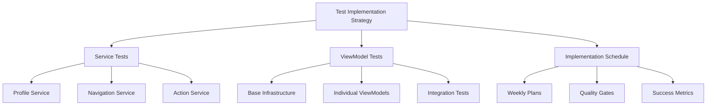
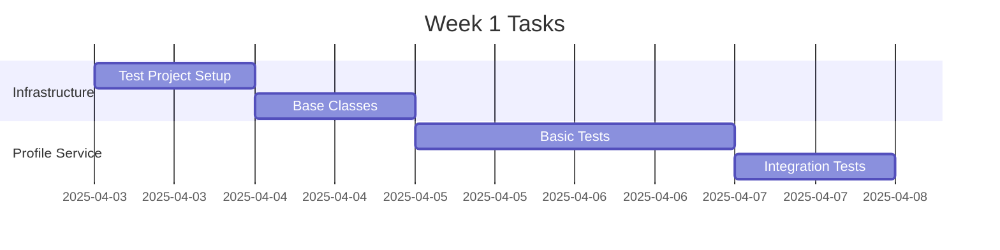
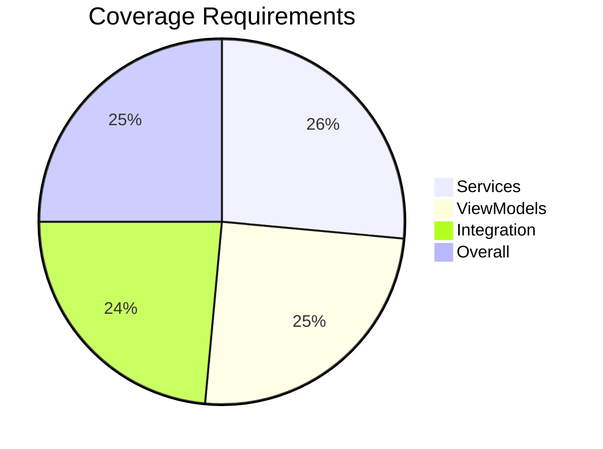

# Test Implementation Summary and Next Steps

## Overview of Test Strategy

We have developed a comprehensive test implementation strategy covering:

1. Core Services
2. ViewModels
3. Integration Tests
4. Test Infrastructure

## Documentation Structure



## Key Documents

1. **Test Implementation Plan**
   - Overall testing strategy
   - Infrastructure setup
   - Testing patterns
   - Quality metrics

2. **Service Test Plans**
   - Profile Service tests
   - Navigation Service tests
   - Action Service tests

3. **ViewModel Test Plan**
   - Base infrastructure
   - Individual ViewModels
   - Common patterns

4. **Implementation Schedule**
   - Week-by-week breakdown
   - Quality gates
   - Success metrics

## Next Steps

### Immediate Actions (Week 1)

1. Infrastructure Setup


2. First Service Implementation
   - Begin with ProfileService
   - Follow test plan structure
   - Establish patterns for other services

### Development Process

1. **For Each Component**
   - Review relevant test plan
   - Set up test class
   - Implement test cases
   - Review coverage
   - Document results

2. **Daily Tasks**
   - Morning: Review previous day's work
   - Mid-day: Implementation
   - Evening: Coverage review

3. **Weekly Review**
   - Coverage metrics
   - Implementation progress
   - Plan adjustments

## Required Resources

### Development Environment
- Visual Studio 2022
- .NET SDK 8.0
- Test frameworks
- Code coverage tools

### Test Data
- Sample profiles
- Test actions
- Mock configurations

### Documentation
- Test plans
- Implementation guides
- Coverage reports

## Success Criteria Review

### Code Coverage Targets


### Quality Metrics
1. Test Coverage
   - Services: 90%+
   - ViewModels: 85%+
   - Integration: 80%+

2. Performance
   - Test execution < 5 minutes
   - Memory usage < 2GB

3. Documentation
   - All test classes documented
   - Implementation guides complete
   - Coverage reports generated

## Implementation Guidelines

### 1. Test Structure
```csharp
[TestClass]
public class ServiceTests : UnitTestBase
{
    private IService _service;
    
    [TestInitialize]
    public override async Task InitializeTest()
    {
        await base.InitializeTest();
        // Setup for specific test class
    }

    [TestMethod]
    public async Task TestMethod_Scenario_ExpectedResult()
    {
        // Arrange
        // Act
        // Assert
    }
}
```

### 2. Code Organization
- One test class per service/ViewModel
- Clear test method names
- Organized test categories
- Shared test utilities

### 3. Best Practices
- Follow AAA pattern
- Independent tests
- Clear error messages
- Comprehensive assertions

## Review Process

### Daily Reviews
1. Code coverage check
2. Test execution time
3. Failed tests analysis
4. Documentation updates

### Weekly Reviews
1. Coverage trends
2. Implementation progress
3. Plan adjustments
4. Resource needs

## Risk Management

### Identified Risks
1. Complex UI interactions
2. Performance bottlenecks
3. Integration challenges

### Mitigation Strategies
1. Early integration testing
2. Regular performance checks
3. Comprehensive error handling

## Support and Resources

### Documentation
- Test plans
- Implementation guides
- Best practices

### Tools
- Test frameworks
- Coverage tools
- Performance profilers

### Communication
- Daily updates
- Weekly reviews
- Issue tracking

## Start of Implementation

To begin implementation:

1. Review test infrastructure
2. Set up test project structure
3. Implement first service tests
4. Review and adjust plans

## Call to Action

1. Review all test plans
2. Set up development environment
3. Begin with Profile Service implementation
4. Schedule daily reviews

Let's proceed with implementing the Profile Service tests following the detailed plan in profile_service_test_plan.md.