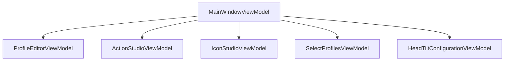

# ViewModel Test Implementation Plan

## Overview
ViewModels act as the bridge between UI and business logic. Testing will focus on data binding, command execution, and service integration.

## Key ViewModels to Test



## Test Infrastructure

### Base Test Setup
```csharp
public abstract class ViewModelTestBase : UnitTestBase
{
    protected Mock<INavigationService> MockNavigation;
    protected Mock<IProfileService> MockProfileService;
    protected Mock<IActionService> MockActionService;
    protected Mock<IDialogService> MockDialogService;

    [TestInitialize]
    public override async Task InitializeTest()
    {
        await base.InitializeTest();
        
        MockNavigation = new Mock<INavigationService>();
        MockProfileService = new Mock<IProfileService>();
        MockActionService = new Mock<IActionService>();
        MockDialogService = new Mock<IDialogService>();
    }
}
```

## Test Categories Per ViewModel

### 1. ProfileEditorViewModel Tests

```csharp
[TestClass]
public class ProfileEditorViewModelTests : ViewModelTestBase
{
    private ProfileEditorViewModel _viewModel;

    [TestInitialize]
    public override async Task InitializeTest()
    {
        await base.InitializeTest();
        _viewModel = new ProfileEditorViewModel(
            MockProfileService.Object,
            MockNavigation.Object,
            MockDialogService.Object
        );
    }

    [TestMethod]
    public async Task LoadProfile_ValidProfile_LoadsSuccessfully()
    [TestMethod]
    public async Task SaveProfile_ValidChanges_SavesSuccessfully()
    [TestMethod]
    public async Task ValidateProfile_InvalidData_ShowsErrors()
}
```

### 2. ActionStudioViewModel Tests

```csharp
[TestClass]
public class ActionStudioViewModelTests : ViewModelTestBase
{
    private ActionStudioViewModel _viewModel;

    [TestInitialize]
    public override async Task InitializeTest()
    {
        await base.InitializeTest();
        _viewModel = new ActionStudioViewModel(
            MockActionService.Object,
            MockNavigation.Object,
            MockDialogService.Object
        );
    }

    [TestMethod]
    public async Task CreateAction_ValidInput_CreatesSuccessfully()
    [TestMethod]
    public async Task ExecuteAction_ValidAction_ExecutesSuccessfully()
    [TestMethod]
    public async Task ValidateAction_InvalidData_ShowsErrors()
}
```

## Common Test Patterns

### 1. Property Change Notifications
```csharp
[TestMethod]
public async Task PropertyChange_NotifiesCorrectly()
{
    // Arrange
    var propertyChangedRaised = false;
    _viewModel.PropertyChanged += (s, e) => 
    {
        if (e.PropertyName == nameof(ViewModel.Property))
            propertyChangedRaised = true;
    };

    // Act
    _viewModel.Property = "new value";

    // Assert
    Assert.IsTrue(propertyChangedRaised);
}
```

### 2. Command Execution Tests
```csharp
[TestMethod]
public async Task Command_WhenConditionMet_Executes()
{
    // Arrange
    SetupCommandDependencies();

    // Act
    var canExecute = _viewModel.Command.CanExecute(null);
    await _viewModel.Command.ExecuteAsync(null);

    // Assert
    Assert.IsTrue(canExecute);
    VerifyCommandExecution();
}
```

### 3. Validation Tests
```csharp
[TestMethod]
public async Task Validation_WithErrors_ShowsErrorMessages()
{
    // Arrange
    SetupValidationScenario();

    // Act
    await _viewModel.ValidateAsync();

    // Assert
    Assert.IsTrue(_viewModel.HasErrors);
    Assert.IsNotNull(_viewModel.GetErrors("PropertyName"));
}
```

## Implementation Approach

### Phase 1: Basic ViewModel Setup
1. Create test classes for each ViewModel
2. Set up mock dependencies
3. Implement basic property tests
4. Add command execution tests

### Phase 2: Service Integration
1. Test service method calls
2. Verify error handling
3. Test navigation flows
4. Validate dialog interactions

### Phase 3: Data Binding
1. Test property change notifications
2. Implement collection change tests
3. Verify validation rules
4. Test error messaging

### Phase 4: Complex Scenarios
1. Test state management
2. Implement navigation flows
3. Test dialog interactions
4. Verify cleanup

## Test Data Management

### 1. Mock Data Generators
```csharp
public static class ViewModelTestData
{
    public static Profile CreateTestProfile()
    {
        return new Profile 
        { 
            Id = "test-id",
            Name = "Test Profile",
            Settings = new Dictionary<string, object>()
        };
    }

    public static Action CreateTestAction()
    {
        return new Action
        {
            Id = "test-action",
            Name = "Test Action",
            Type = "TestType"
        };
    }
}
```

### 2. Mock Service Responses
```csharp
protected void SetupMockServices()
{
    MockProfileService
        .Setup(s => s.GetProfileAsync(It.IsAny<string>()))
        .ReturnsAsync(ViewModelTestData.CreateTestProfile());

    MockActionService
        .Setup(s => s.GetActionAsync(It.IsAny<string>()))
        .ReturnsAsync(ViewModelTestData.CreateTestAction());
}
```

## Error Handling Tests

### 1. Service Exceptions
```csharp
[TestMethod]
public async Task ServiceError_ShowsErrorMessage()
{
    // Arrange
    MockProfileService
        .Setup(s => s.SaveProfileAsync(It.IsAny<Profile>()))
        .ThrowsAsync(new Exception("Test error"));

    // Act
    await _viewModel.SaveCommand.ExecuteAsync(null);

    // Assert
    MockDialogService.Verify(
        d => d.ShowErrorAsync(It.IsAny<string>()),
        Times.Once);
}
```

### 2. Validation Errors
```csharp
[TestMethod]
public async Task ValidationError_BlocksSave()
{
    // Arrange
    _viewModel.Name = ""; // Invalid name

    // Act
    await _viewModel.SaveCommand.ExecuteAsync(null);

    // Assert
    MockProfileService.Verify(
        s => s.SaveProfileAsync(It.IsAny<Profile>()),
        Times.Never);
}
```

## Success Criteria

### 1. Code Coverage
- Properties: 100% coverage
- Commands: 100% coverage
- Error handlers: 90% coverage
- Overall: 90% coverage

### 2. Test Quality
- All property changes tested
- All commands tested
- Error scenarios covered
- Navigation flows verified

### 3. Performance
- Command execution time tracked
- Property updates efficient
- Memory usage monitored

## Next Steps

1. Implement base ViewModel test class
2. Create test classes for each ViewModel
3. Add property change tests
4. Implement command tests
5. Add service integration tests

## Notes

- Consider testing async command cancellation
- Test cleanup and disposal
- Verify memory leaks
- Test navigation parameters
- Consider UI thread synchronization
- Test dialog result handling
- Verify state preservation during navigation